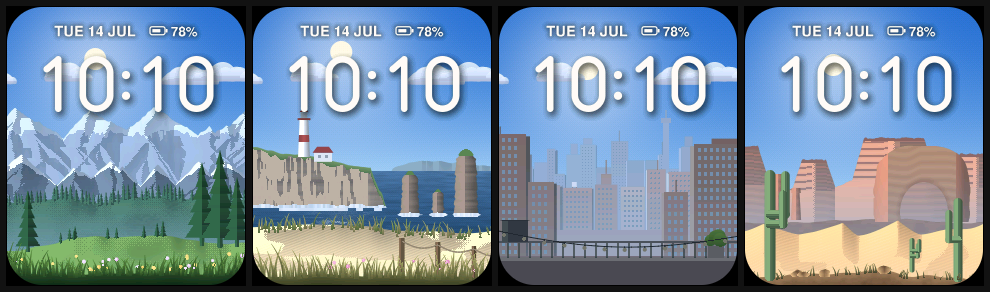
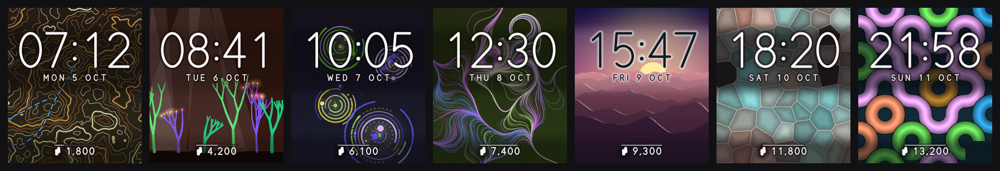
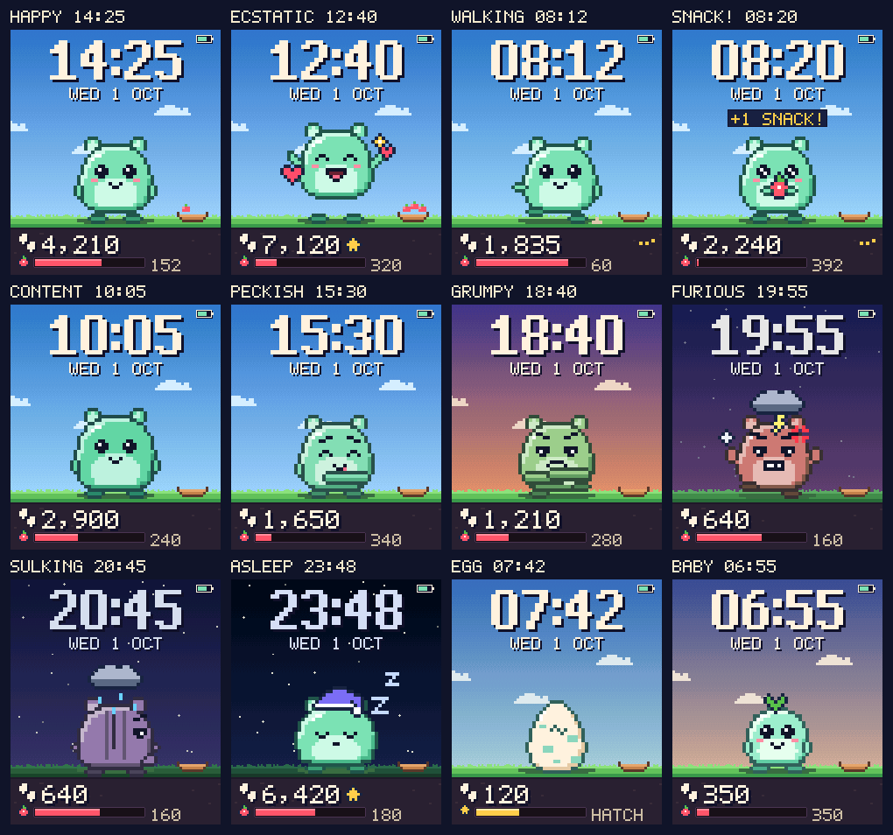
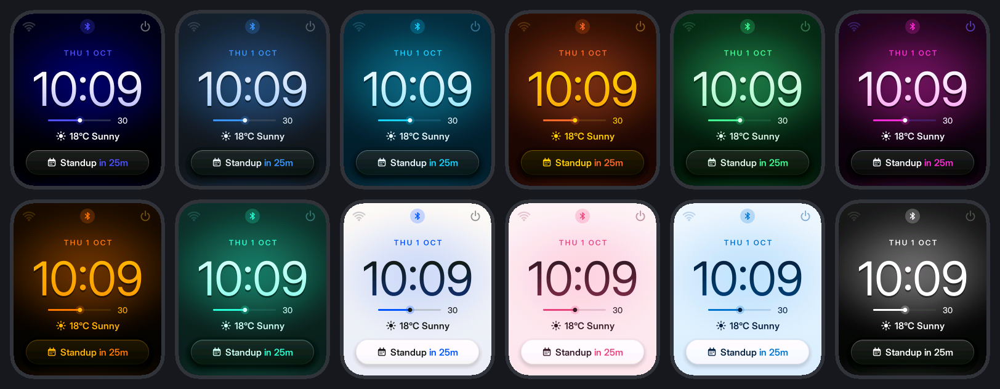

# EWatch addons

Eight addons for the [EWatch](https://github.com/Ewan-Wills/EWatch_Dev), Ewan
Wills' open-source ESP32-S3 smartwatch, built to be listed individually on
[ewatch.cloud](https://ewatch.cloud).

Each addon is a **complete standalone firmware**: EWatch BaseOS (`dbe73c2`)
plus one app or watch face. Installing one gives a fully working watch (face,
launcher, settings, sleep) with that feature added.

> **Status:** every addon compiles with zero warnings, passes its host test
> suite and is packaged. **None has run on a real watch yet.** Each README ends
> with a hardware test checklist covering what still needs confirming on the
> device: timing, battery draw, sensor tuning and Bluetooth range.

## The addons

| Addon | Folder | Type | Version | Tests | App size |
|---|---|---|---|---|---|
| **Tilt Parallax**: a layered landscape that shifts with your wrist, so the screen reads as a window into a 3D scene | [`Tilt_Parallax`](addons/Tilt_Parallax) | watch face | 1.0.0 | 26 | 34% |
| **Friend Radar**: spot friends' EWatches nearby over Bluetooth, then buzz and share an animation when a mate comes close | [`Friend_Radar`](addons/Friend_Radar) | app | 1.1.0 | 86 | 41% |
| **Dayprint**: a new artwork every day, seeded by the date and grown by your steps, kept in a year-long gallery | [`Generative_Face`](addons/Generative_Face) | watch face | 1.0.0 | 46 | 19% |
| **Rep Counter**: counts curls, presses, raises and rows, buzzes when a set is done and times your rest | [`Rep_Counter`](addons/Rep_Counter) | app | 1.0.0 | 48 | 35% |
| **Shake Oracle**: ask a question, shake your wrist, and a glowing die rises with your answer | [`Magic_8_Ball`](addons/Magic_8_Ball) | app | 1.0.0 | 54 | 16% |
| **Stepmunk**: a pixel pet that only eats when you walk, and gets visibly grumpy when you don't | [`Pixel_Pet`](addons/Pixel_Pet) | game | 1.0.0 | 46 | 17% |
| **Meeting Countdown**: a ring drains toward your next meeting, with a buzz five minutes before, even while asleep | [`Meeting_Countdown`](addons/Meeting_Countdown) | watch face | 1.0.0 | 60 | 42% |
| **EWatch Companion**: restyle the watch live from a Web Bluetooth page: the Halo face, colours, complications, weather and countdowns | [`BLE_Companion`](addons/BLE_Companion) | tool | 1.1.0 | 26 + 54 web | 40% |

"App size" is the share of the 3 MB app partition. Folder names are working
names; marketplace ids and display names live in each addon's `addon.json`.

<table>
<tr>
<td width="50%"></td>
<td width="50%"></td>
</tr>
<tr>
<td></td>
<td></td>
</tr>
<tr>
<td></td>
<td></td>
</tr>
<tr>
<td></td>
<td></td>
</tr>
</table>

## Repository layout

```
addons/<Folder>/        one PlatformIO project per addon (BaseOS + the feature)
  addon.json            marketplace metadata (id, name, version, type, capabilities)
  README.md             what it does, design notes, power, hardware test checklist
  CLAUDE.md             architecture map for future agents (BaseOS guide below it)
  docs/                 host-rendered previews (also usable as listing screenshots)
  test/                 Unity tests: `pio test -e native`
  web/                  companion web page (BLE_Companion only)
tools/package_addon.py  builds an addon and writes its flashable package to dist/
ADDON_GUIDE.md          shared conventions every addon follows (hardware, power, packaging)
EWATCH_BUG_REPORT.md    bugs found in upstream BaseOS, written for Ewan's agents
```

## Building

You need [PlatformIO Core](https://platformio.org/install/cli). The addons
were built against Espressif32 platform 7.1.3 (Arduino-ESP32 2.0.17).

```sh
pio run -d addons/Tilt_Parallax                 # build the firmware
pio test -d addons/Tilt_Parallax -e native      # run the host tests (no watch needed)
python3 tools/package_addon.py addons/Tilt_Parallax   # build + package into dist/
```

The packager writes `dist/` inside the addon folder:
- the four flash parts;
- an [ESP Web Tools](https://esphome.github.io/esp-web-tools/) `manifest.json`
  that leaves the watch's saved settings alone;
- a single merged image, which **does** erase settings;
- `addon.json` with checksums, the companion page if there is one, and a zip.

`dist/` is git-ignored; rebuild it when needed.

[`ADDON_GUIDE.md`](ADDON_GUIDE.md) and some tools refer to upstream sources at
`EWatch_Dev/`. To get them:

```sh
git clone https://github.com/Ewan-Wills/EWatch_Dev.git EWatch_Dev
git -C EWatch_Dev checkout dbe73c2
```

## Fixes over upstream BaseOS

Every addon carries these fixes, all reported upstream in
[`EWATCH_BUG_REPORT.md`](EWATCH_BUG_REPORT.md):
- The crash-loop guard now actually trips. Upstream's counter lived in
  `RTC_DATA_ATTR`, which is reset on every crash.
- Going to sleep can no longer deadlock the I2C bus. `taskIO` now parks itself
  between transactions instead of being suspended from outside.
- The timer alarm buzzes at full strength (`400` overflowed a `uint8_t`).

Stepmunk and Dayprint include further sleep-path fixes; see their READMEs.

## Open items

- **ewatch.cloud project format.** The marketplace compiles in the cloud, so it
  may expect source projects (or apps that plug into a shared OS) rather than
  full firmwares. Adjust once the developer docs are known.
- **Licence for paid listings.** BaseOS is MIT, and each addon keeps Ewan's
  licence notice in `LICENSE`. The addons' own `addon.json` files also say MIT,
  which would let buyers redistribute them. Decide the licence for the
  original code before selling.
- **Battery figures.** All estimates assume a 200–300 mAh cell until the real
  capacity is known.
- **WiFi.** Shake Oracle, Dayprint and Stepmunk compile WiFi out, so they have
  no network time sync. The others keep it.
