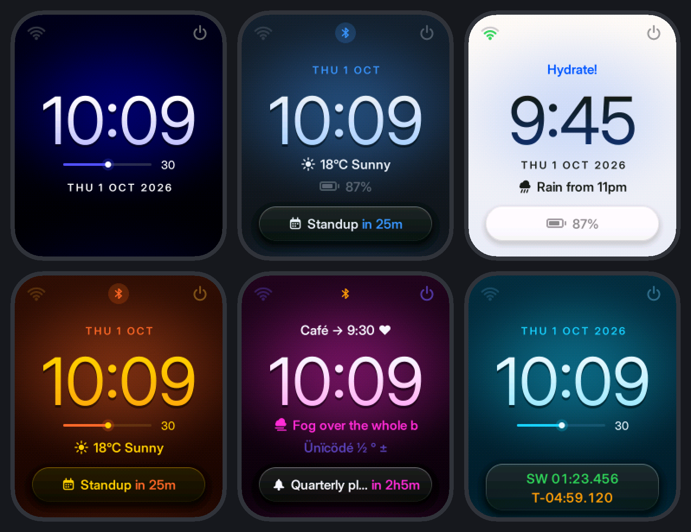
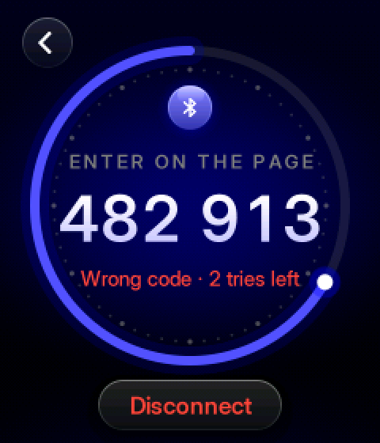
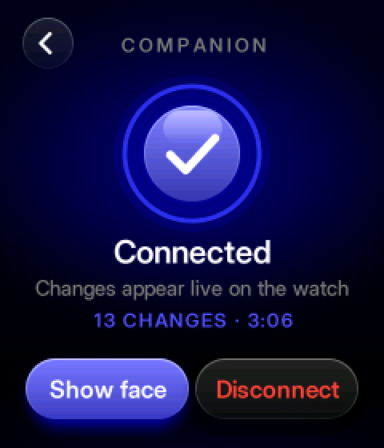
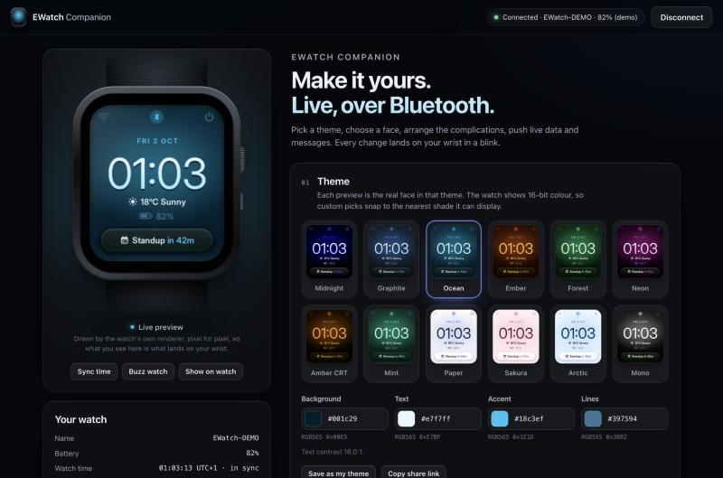

# EWatch Companion

Restyle your EWatch **live, from a web page, over Bluetooth**, with no reflashing.
Open **Companion** on the watch, open the Companion page in Chrome or Edge, type
the 6-digit code the watch shows, and every change appears on your wrist as you
make it: theme colours, brightness, clock style, 12-hour time, and four data
slots around the time. The slots can show seconds, the date, the battery, your
own text, or live values pushed from the page, such as the weather or a
countdown to your next meeting. The page also syncs the clock and can send a
message to the watch.

This is a complete EWatch firmware: BaseOS (launcher, settings, sleep, WiFi
settings) plus the companion and **Halo**, a new anti-aliased watch face that
fresh installs start on. BaseOS's own eight face styles are all still there;
*Classic* with the default slots is pixel-identical to stock BaseOS.



| Pairing on the watch | Connected | The web page |
|---|---|---|
|  |  |  |


### What's new in 1.1

Version 1.1 redesigns every surface around one idea: **the theme's accent is
the light source.** See [docs/compare_v1_v2.png](docs/compare_v1_v2.png) for
v1 and v2 side by side.

- **Halo face** (style 8, the new default): large Inter Display numerals with
  a soft accent halo behind them and a faint rim light at the bottom; the
  slots become quiet complications (small-caps dates, icon + value lines, a
  seconds track with a glowing knob, one glass card at the bottom). Colours
  are derived from your four theme colours and contrast-corrected, so all 12
  presets, light themes and even broken themes stay legible.
- **Companion screens and messages**, redrawn with anti-aliased type, glossy
  orbs and pill buttons with depth. The pairing code sits inside a dial that
  drains over the 60 s you have to type it, under a gently breathing
  Bluetooth glyph; the connected state closes the ring around a check.
- **The web page**: a lit hero watch with a realistic case, live thumbnails
  of every preset and every face style, refined controls and restrained
  motion. The preview is still pixel-exact (now 41 golden frames).
- Protocol **v1.1** (additive): style 8 in the style list, *Reset colours*
  returns to Halo. v1.0 pages and firmware keep working with v1.1.

---

## Using it

### On the watch

| You do | What happens |
|---|---|
| Swipe **left** (or up) on the face | The launcher opens. **Companion** is the first tile. |
| Open **Companion** | The watch becomes visible to browsers as `EWatch-XXXX` for 3 minutes. Sonar rings pulse from a glowing Bluetooth orb; the time left counts down at the bottom and **Hide** stops it early. The screen stays lit while visible and dims after 30 s. |
| A browser connects | The watch buzzes and shows the **6-digit code** in large type inside a dial that drains over the 60 s you have to enter it, under a gently breathing Bluetooth glyph. Wrong codes and tries left show in red. If you were elsewhere it switches to this screen. **Disconnect** drops the browser. |
| The code is accepted | Double buzz, the ring closes around a check, "Connected", and after 1.5 s the watch shows its face so you can watch your edits land. |
| While connected | The watch stays awake, dims after 30 s without touches or edits, and brightens on the next one. The Companion screen shows the session time and the number of changes. |
| A message arrives | Two buzzes and the message appears in a glass card under an icon orb for 20 s, with a bar that drains until it closes. Tap or press the button to dismiss. If you're in a settings page it waits until you're back on the face. |
| Button, or swipe right | Back, as everywhere in BaseOS. |
| Companion is off: hold **Reset face** or **Reset colours** for 1 s | Safety nets if a theme makes the watch hard to read: restore the stock slots, or the BaseOS colours and the Halo face. The button fills as you hold. They work without a browser. |
| Too many wrong codes | A red ring with a lock drains over the 30 s lockout. |

The top centre of the face shows the Bluetooth state: on Halo a small rune
(dim when visible, amber while waiting for the code, lit in the accent when a
page is connected); on the Classic styles BaseOS-style link glyph (grey,
orange, blue).

### In the browser

1. Open the Companion page (`web/index.html`, served over **HTTPS**) in
   **Chrome or Edge** on Windows, macOS, ChromeOS or Android.
2. Press **Connect**, choose `EWatch-XXXX`, and type the code from the watch.
3. Edit. Changes are debounced (about 0.1–0.35 s), written to the watch, drawn
   immediately, and saved on the watch.

The page offers:

- **Theme**: 12 curated themes, each shown as a live thumbnail of *your* face
  in that theme, four colour pickers with hex input, the exact RGB565 value the
  watch will use, and a contrast warning. The page itself is lit by the
  face's accent.
- **Face**: Halo plus the BaseOS styles (Classic, Sans, Bold, Serif, Mono,
  Digital, Outline, Shadow; the list comes from the watch), each as a live
  thumbnail, a 12-hour clock and brightness.
- **Complications** (the data slots): Top, Upper, Lower and Bottom, each with
  a source, a colour (text, accent or dim) and an icon toggle. Hovering a row
  outlines it in the preview.
- **Your text**: four 20-byte labels with byte counters, plus a warning when a
  character can't be drawn by the watch font.
- **Live data**: four values or countdowns, each with an icon and an
  auto-hide time. **Fill with local weather** is an opt-in helper that asks for
  your location and fetches the current conditions from open-meteo.com.
- **Send a message**, **Sync time** (also automatic on connect), **Buzz watch**,
  **Show face on watch**, **Reset face**, **Reset colours**.
- **Themes**: save named themes in the browser (localStorage), and **copy a
  share link** (`#look=…`) that carries colours, style and slot layout. Opening
  a share link offers *Apply / Save / Dismiss*.
- **Demo mode**: a pretend watch that speaks the same protocol through the same
  codec, so the page can be explored without hardware. Its code is shown in the
  pairing dialog.
- A **live 240×280 preview** in a lit watch case that runs a JavaScript port
  of the firmware's own face renderers, fonts and icons. The test suite checks
  it is pixel-identical to the firmware on 41 scenarios (26 of them Halo,
  including all 12 presets). On phones a small floating copy follows you while
  you scroll.

Browser support (October 2026): Chrome and Edge on Windows, macOS, ChromeOS
and Android (Android 6+), and Samsung Internet. **Not** Firefox, Safari, any
browser on iPhone or iPad, or Android in-app browsers. Linux needs Chrome's
"Experimental Web Platform features" flag. The page detects each of these
cases and explains it, offering the demo instead.

## The face slots

| Slot | Halo | Classic styles | Default |
|---|---|---|---|
| Top | line above the time | above the time (y 68), text size 2 | nothing |
| Upper | line below the time | the stock seconds row, size 3 | seconds |
| Lower | the line under that | the stock date row, size 2 | date |
| Bottom | a glass card | y 250, size 2 | nothing |

The bottom slot yields to BaseOS's stopwatch/timer lines while those run (on
Halo they move into the card).

Sources: nothing, seconds, date (`Thu 1 Oct 2026`), short date (`Thu 1 Oct`),
battery (glyph + `87%`, red below 15 %), text 1–4, live data 1–4. On Halo,
dates are set as spaced small caps, seconds as a track with a moving knob,
and text is fitted by pixel width and cut with `…`; countdowns keep their
`in 25m` (in the accent) and shorten the label instead. On the Classic styles
text drops from size 3 to 2, then is cut with `..`. Every style draws the same
CP437 glyph set, so `°`, `£`, accented Latin letters, arrows, card suits and
`♥` work, while emoji, CJK and Cyrillic show as `?` (see
[docs/PROTOCOL.md](docs/PROTOCOL.md#4-text-on-the-watch)).

Live data is computed on the watch: a countdown keeps counting after the page
disconnects, and values disappear at their expiry time. The icons are sun,
partly cloudy, cloud, rain, storm, snow, fog, moon, calendar, bell, heart,
star, chat, check and alert: anti-aliased masks at 16 and 34 px on Halo and
the Companion screens, integer-scaled vectors on the Classic styles.

## Security

### Threat model

| Asset | Threat | Severity |
|---|---|---|
| The watch's appearance and slots | A passer-by restyles it, or puts misleading text on it | Annoying, could be used to mislead |
| The watch's clock | Someone sets a wrong time and the owner misses things | Moderate |
| Messages | Spoofed messages ("call your bank…") | Moderate |
| Text, feeds, meeting names | Read by someone nearby | Low sensitivity, but personal |
| Battery | Someone keeps the watch awake | Low |

Attackers considered: **(A1)** a casual passer-by with a phone running a BLE
app or a Web Bluetooth page. This is the target, and it is defeated. **(A2)** a
malicious web page: it can't connect without the user picking the watch in the
browser's chooser, and even then it needs the code on the watch. **(A3)** a
determined attacker with a BLE sniffer or injection hardware: partly out of
scope, see the residual risks below.

### Design

- **Invisible by default.** The watch only advertises after the user opens
  Companion: for 3 minutes, never while connected, never in deep sleep. TX
  power is +3 dBm instead of the default +9 dBm, which shrinks the range too.
- **App-level pairing.** Each connection gets a fresh random 6-digit code
  that exists only on the watch's screen. Until it is written to the Auth
  characteristic, protected reads return nothing and writes are ignored (and
  reported as "not authorised"). Only Info, Auth, Battery and Device
  Information are open.
- **Limited guessing.** 3 attempts per connection, then the link drops and the
  watch hides for 30 s. One connection at a time, 60 s to enter the code, and
  the watch must still be in its 3-minute window. That allows a few hundred
  guesses per opened window, a chance of about 0.03 % of guessing a
  1-in-a-million code. The owner sees every attempt on the screen, with a buzz.
- **Visible and revocable.** The watch shows when a browser is connected (link
  glyph, Companion screen), and **Disconnect** on the watch drops it at once.
- **Bounded.** An authorised session with no edits and no touches for 5 min is
  dropped, so a forgotten tab can't keep the watch awake.

### Why not OS-level pairing (passkey bonding)?

Research summary (October 2026, from Chromium's source, the Web Bluetooth
community group's status pages, and the Android, BlueZ and NimBLE sources):

- Web Bluetooth has **no API to pair or unpair**. Pairing only happens
  implicitly when a characteristic returns an authentication error.
- Passkey entry works on **Android** (system dialog, sometimes only a
  notification), on **Windows** (Chrome's own passkey dialog since Chrome 96)
  and on macOS (OS prompt; macOS 12.0–12.2 had regressions). It is **rejected
  on Linux**: Chrome's handler cancels passkey requests.
- "Just Works" encryption **fails by default on Windows** (it needs a
  `chrome://flags` switch) and asks for confirmation on Android.
- **Stale bonds break things for good.** When the watch loses its keys
  (reflash with an erase, NVS wipe, the 3-bond limit), the phone or PC keeps
  its half and every connection fails until the user finds "Forget device" in
  OS settings. On a marketplace where people reinstall firmware, that is a
  support nightmare.

So the companion uses **app-level pairing only**. It behaves the same on every
Chrome platform, needs no OS dialogs, and leaves nothing to forget.

### Residual risks and options

- The link is **not encrypted**. Someone with a BLE sniffer near you while you
  edit can read what you send: colours, texts, feed and message text. They
  can't reuse the code, which is single-use per connection. Avoid putting
  secrets in texts or messages.
- An attacker with **injection hardware** could in theory hijack an
  established unencrypted connection. This is out of scope for a
  watch-styling tool.
- **Experimental:** building with `-DEWATCH_BLE_REQUIRE_ENCRYPTION=1` adds
  link encryption (LE Secure Connections "Just Works", no bonding) on top of
  the code. It defeats passive sniffing but will fail on Windows unless the
  user enables Chrome's confirm-pairing flag, so it is **off by default**.

## Power

| State | Estimate | Notes |
|---|---|---|
| Asleep / off | unchanged from BaseOS | the radio only runs while the watch is awake; deep sleep is a full reboot, so BLE starts off |
| Awake, not using Companion | unchanged | the BLE stack isn't even started until Companion is opened |
| Companion visible (advertising) | about +1–2 mA on top of the awake screen | 100–150 ms interval, +3 dBm; at most 3 minutes per opening |
| Browser connected | about +1–3 mA (30–50 ms interval), plus the screen staying on | dims to ¼ brightness after 30 s idle; dropped after 5 min idle |

**Battery estimate** (unmeasured; assumes a 250 mAh cell and about 70 mA for
an awake EWatch with the backlight at 200/255): a typical 5-minute editing
session costs about 6 mAh, **2–3 % of the battery**. A forgotten browser tab
is capped at 5 minutes, mostly dimmed (about 55 mA), so about 4.5 mAh or under
2 %. Between sessions the addon costs nothing; the slots and live data are
drawn from NVS and RTC readings the face already makes. Flash wear is minimal
because NVS saves are debounced to 1.5 s after the last edit.

Footprint: 1,267,313 B flash (40.3 % of the 3 MB app partition; BaseOS is
30.9 %, v1.0 was 37.3 %), 60,096 B static RAM (18.3 %; v1.0 58,232 B). Of the
1.1 growth, about 72 KB are the anti-aliased type and icon atlases (const, in
flash) and 1.4 KB of RAM is a glow table. NimBLE allocates its host and
controller memory (an estimated 50–70 KB of internal heap) only when
Companion is first opened.

**Drawing cost** (measured on an Apple-silicon host; expect it to take
roughly 30–60× longer on the ESP32-S3, unverified): a full Halo frame takes
0.34 ms on the host, the
per-second update of the seconds slot 0.02 ms, and the Companion screens'
animated rectangles 0.09–0.26 ms per frame at about 15 fps. Only changed rows
or rectangles are pushed to the panel.

## How it works

```
web/index.html  ── Web Bluetooth ──▶  NimBLE host task ──▶ ble_config.cpp (validate, apply, auth)
  CORE: codec, glyphs,                                    │  model (theme, brightness, style, tz) + Storage::save()
  slot layout, GFX port,                                  │  FaceStore (slots, texts, feeds) ── NVS "ble-companion"
  icons, face renderer                                    ▼
                                         "blecfg" service task (core 0): advertising window, timeouts,
                                         notifications, debounced NVS saves, backlight
                                                          │  events: BleState / BleMessage / BleRequest
                                                          ▼
                                         taskRender: keep-awake, dimming, screen routing
                                            WatchFaceView ─▶ FaceRender (face_render.cpp + face_icons.cpp)
                                                             draws into the PSRAM canvas, pushes dirty rows only
```

- **Wire protocol**: [docs/PROTOCOL.md](docs/PROTOCOL.md). There are 12
  characteristics, every notification is ≤ 20 bytes, and texts and feeds are
  re-read on change. NimBLE-Arduino 1.4.3 can't return ATT errors from write
  callbacks (and pairing-style errors would trigger OS prompts), so write
  results travel in a small Revision notification instead.
- **Threading**: GATT callbacks run on the NimBLE host task and only validate
  and apply under short locks (lock order: companion mutex → FaceStore mutex →
  `ModelLock`). Notifications, NVS writes, backlight changes and advertising
  are handled by a small service task, and the UI is told through events.
  Nothing new touches `Wire`, and nothing draws outside `taskRender`.
- **The face** was extracted from BaseOS's `view.cpp` into
  `src/apps/face/face_render.cpp` with unchanged behaviour, then extended with
  slots, a 12-hour option and the BLE glyph. It draws into the shared PSRAM
  frame canvas and pushes only the rows that changed, so live colour edits
  don't flicker. It falls back to drawing directly if PSRAM is unavailable.
- **Anti-aliasing with integer maths only** (`src/apps/face/aa_gfx.*`):
  coverage comes from integer signed distances (rounded boxes, discs, rings,
  arcs, capsules) and `isqrt32`, gradients are mixed at 16-bit precision and
  ordered-dithered to RGB565, and type and icons are 4-bit coverage masks
  rendered offline from Inter Display by `tools/gen_aa_assets.py`. No floats
  means the watch, the host and the browser agree bit for bit.
- **Halo** (`face_halo.*`) lays a frame out (`buildScene`) and paints whatever
  intersects the clip. Every element stays inside its own band of rows, so
  the renderer repaints only bands whose content changed (a running stopwatch
  repaints just its digits); `tools/preview` checks that partial repaints
  equal full ones.
- **Companion screens** (`companion_ui.*`, pure C++) paint a model of the
  state; `companion.cpp` repaints and pushes only the rectangles that change
  (the pulse, the ring's moving end, a countdown). Without the PSRAM canvas
  they fall back to plain text so pairing still works.
- **Pixel-exact preview**: the page carries a JavaScript port of the exact
  Arduino_GFX 1.4.9 + Arduino_Canvas primitives (for the Classic styles), of
  the anti-aliasing engine and of Halo, with the same glyph data.
  `tools/preview/render.py` compiles the firmware's renderers against the real
  library on the host and writes golden frames, and
  `test/web/preview.test.mjs` requires 0 differing pixels.
- **Persistence**: theme, brightness, style and UTC offset use BaseOS's own
  `ewatch` NVS keys, so they carry across addons. Slots, texts, feeds, face
  options and the config revision live in the addon's own namespace
  `ble-companion`.

## Limitations

- **No hardware was available.** The BLE stack, radio behaviour, timings,
  current figures, range and haptics are all unverified on a real watch. See
  the checklist below.
- Web Bluetooth isn't available on iOS or in Firefox and Safari (demo mode
  only there).
- The watch must be **awake** to connect: open Companion first. Deep sleep
  (5 s idle on the face by default) ends visibility.
- No reconnect without the chooser across page reloads: Chrome's
  `getDevices()` is still behind a flag. Within one page session, **Reconnect**
  skips the chooser.
- The link is unencrypted by default (see Security).
- Text is limited to the watch's CP437 font. Texts and feed labels are 20
  bytes; messages are 64.
- The countdown and expiry logic trusts the watch's RTC and UTC offset; the
  page syncs both on connect. The offset is fixed, so a DST change needs a
  re-sync.
- Weather comes from open-meteo.com on request only, and needs location
  permission and network access.
- The anti-aliased face and screens need the PSRAM frame canvas. Without it
  Halo falls back to the Classic style and the Companion screens to plain
  text.
- The Companion screens' animations (sonar rings, breathing glyph, draining
  ring) cost CPU while they run (estimated 10–20 % of one core at about
  15 fps); they stop when the screen closes.
- The web page grew to about 290 KB (glyph atlases and the new design); it
  still has no dependencies.

## Build, test, package

```sh
cd addons/BLE_Companion
~/.platformio/penv/bin/pio run                      # firmware (env:ewatch)
~/.platformio/penv/bin/pio test -e native           # C++ codec + slot tests (26 cases, all shared vectors)
node --test test/web/*.test.mjs                     # JS codec + pixel-exact preview tests (54)
python3 tools/preview/render.py                     # host-render faces/screens -> docs/, golden frames,
                                                    # incremental-redraw self-checks (face and screens)
python3 tools/gen_vectors.py                        # regenerate test/vectors/protocol_vectors.json
python3 tools/gen_web_fonts.py                      # re-embed the Classic styles' fonts into web/index.html
python3 tools/gen_aa_assets.py                      # regenerate the anti-aliased type + icon atlases
                                                    # (C++ and web); needs Pillow, numpy and Inter Display
python3 ../../tools/package_addon.py .              # build + package into dist/
```

`render.py` and `gen_web_fonts.py` need `pio run` to have downloaded the GFX
library into `.pio/libdeps` first.

**Serial console** (optional; USB-CDC at 115200, run with any serial monitor,
or `~/.platformio/penv/bin/pio device monitor`): `help`, `ble` (state, name,
and the pairing code while pairing), `ble on`, `ble off`, `ble kick`,
`face reset`, `theme reset`, `mem`.

## Hosting the page

`web/index.html` is a single static file of about 290 KB with no
dependencies. Requirements:

- It must be served over **HTTPS** (localhost also works for development).
- If it is embedded in an iframe, the iframe needs `allow="bluetooth"`.
- It makes no network requests except the opt-in weather lookup, which sends
  rounded coordinates (about 1 km) to `api.open-meteo.com`.
- It stores saved themes and preferences in localStorage under `ewc.*`.

For local testing:

```sh
cd web && python3 -m http.server 8000      # then open http://localhost:8000
```

## Hardware test checklist

1. **Faces:** flash the addon. A fresh install starts on Halo; Settings → Font
   lists Halo first, and choosing Classic must match BaseOS exactly. Settings,
   WiFi and sleep must behave as before. Watch Halo's seconds tick and a
   running stopwatch for smoothness and no tearing.
2. **Visibility:** open **Companion**. Check the sonar rings (smooth, about
   15 fps) and `EWatch-XXXX`, that the screen stays lit, and that it dims
   after 30 s.
   **Hide** works, and after 3 minutes the screen reads "Visibility timed
   out".
3. **Connect from three platforms:** Chrome on Windows, Chrome on macOS and
   Chrome on Android. Check the device appears in the chooser, the watch
   switches to the code, a correct code gives "Connected", and the face shows
   1.5 s later.
4. **Wrong codes:** three wrong codes lock the watch out; it is hidden for 30
   s, then reconnecting works. Also check the 60 s pairing timeout, and that
   **Disconnect** on the watch works in both the pairing and connected states.
5. **Live edits:** test every control: presets, colour dragging (no flicker,
   no watchdog reset over a minute of dragging), styles, 12-hour time,
   brightness, all slot sources, texts with `° é ü ♥` and emoji, value feeds
   and countdowns (check they keep counting after disconnect), messages (also
   from inside Settings), Buzz, Show face, and both resets.
6. **Long writes:** 20-byte texts, 31-byte feeds and 64-byte messages on
   Android and Windows (exercises the default-MTU long-write path).
7. **Persistence:** disconnect, let the watch sleep and wake it, then power it
   off and on: everything must be kept. Install another BaseOS addon and then
   this one again: the theme and the slots must both be kept.
8. **Time sync:** the watch should be within about 1 s of the phone. Change
   the PC's time zone and re-sync.
9. **Idle:** leave a connected page alone. The watch should dim at 30 s and
   drop the link at 5 min, then sleep normally.
10. **Power:** measure current awake without BLE, while advertising, and while
    connected. Deep-sleep current after a BLE session must equal stock BaseOS.
    If it doesn't, call `NimBLEDevice::deinit(false)` in `prepareForSleep()`.
11. **Memory:** run `mem` on the serial console after connecting; free heap
    should stay above about 40 KB. Then turn WiFi on (client mode) while
    connected, to check coexistence.
12. **Range:** at +3 dBm, connect from across a room at 5–10 m.

## Files

| Path | What |
|---|---|
| `src/core/ble_proto.*` | Wire protocol: UUIDs, layouts, validation (pure C++, host-tested) |
| `src/core/face_slots.*` | Slot formatting, UTF-8 → CP437 glyphs, countdowns (pure C++, host-tested) |
| `src/core/face_store.*` | Slots, texts and feeds in RAM plus NVS `ble-companion`, debounced saves |
| `src/core/ble_config.*` | NimBLE GATT server, auth, advertising lifecycle, service task |
| `src/apps/face/face_render.*` | The style table and BaseOS's face (extracted) plus slots, 12-hour time and the BLE glyph; dispatches Halo; host-compilable |
| `src/apps/face/face_halo.*` | Halo, the anti-aliased default face; palette, backdrop and glass card shared with the screens |
| `src/apps/face/aa_gfx.*` | Integer-only anti-aliased drawing engine (mirrored in the page) |
| `src/apps/face/aa_assets.*` | Generated 4-bit type and icon atlases (Inter Display) |
| `src/apps/face/face_icons.*` | 15 feed icons plus battery, integer-scaled vectors (Classic styles) |
| `src/apps/companion_ui.*` | Companion and Message screen painter (pure C++) |
| `src/apps/companion.*` | Companion and Message views: state, input, incremental pushes |
| `web/index.html` | The companion page (single file) |
| `docs/PROTOCOL.md` | Protocol specification |
| `test/test_protocol/` | Unity tests (shared vectors plus exhaustive properties) |
| `test/web/` | Node tests (shared vectors plus the pixel diff against golden frames) |
| `test/vectors/` | `protocol_vectors.json`, `face_scenarios.json`, `frames/*.png` |
| `tools/` | Vector generator, font embedder, atlas generator, host preview renderer |
| `docs/` | Face and screen renders, web screenshots, `compare_v1_v2.png`, `PROTOCOL.md` |

Changed BaseOS files: `src/apps/system/view.cpp` (face moved out, screens
registered, Companion tile, swipe-up opens the launcher), `src/core/controller.cpp`
(BLE events, keep-awake, dimming, sleep preparation; fixed an upstream
`uint8_t` overflow in the timer buzz), `src/core/model.h`, `src/core/event.h`,
`src/main.cpp` (init, serial console), `src/core/model.h` (Halo as the
default style) and `platformio.ini`. Settings → Font lists Halo first.

## Credits and licences

MIT, see `LICENSE`. BaseOS is by Ewan Wills; the companion additions are by
Kyle Hanning.
The web preview embeds glyph bitmaps of the watch's own fonts: the 6×8
glcdfont from GFX Library for Arduino (BSD), and digits from GNU FreeFont
(GPLv3 with the font-embedding exception), as converted by Adafruit. Halo, the
Companion screens and the page's preview use coverage masks rendered from
**Inter Display** by Rasmus Andersson and the Inter Project Authors
([rsms.me/inter](https://rsms.me/inter), SIL Open Font License 1.1); a few
symbols Inter lacks (card suits, smileys, box shades) are drawn by
`tools/gen_aa_assets.py`. Weather
data, when requested, comes from [Open-Meteo](https://open-meteo.com) (CC BY 4.0).
