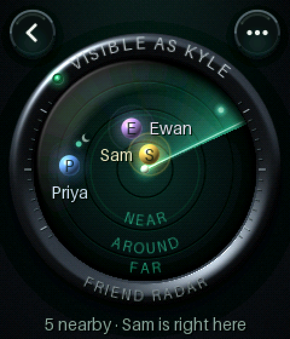
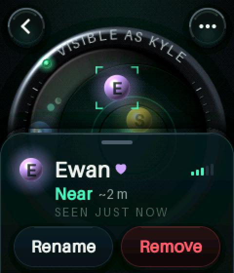
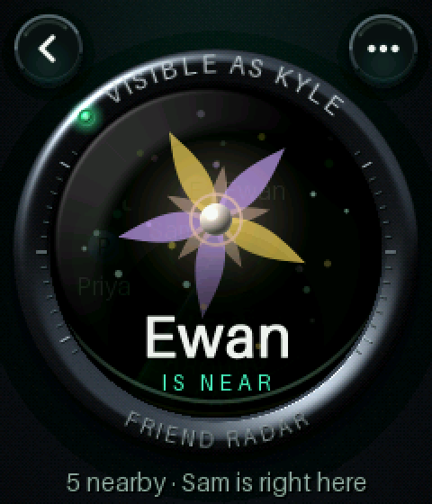
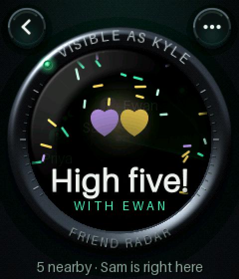
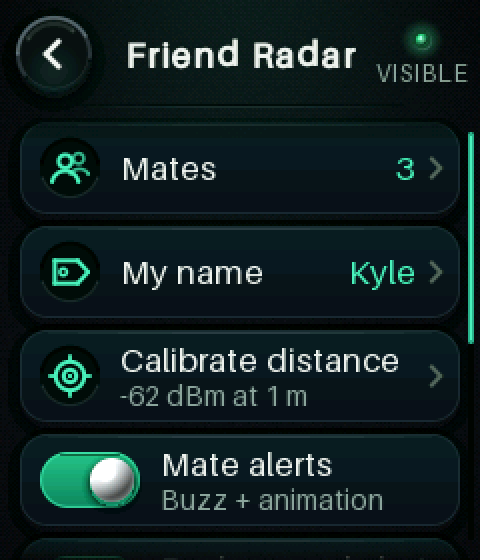
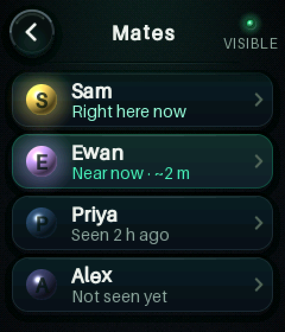
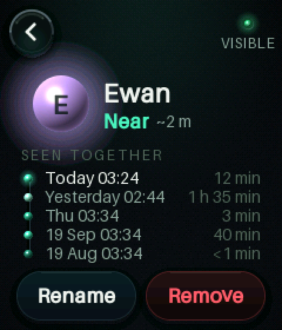
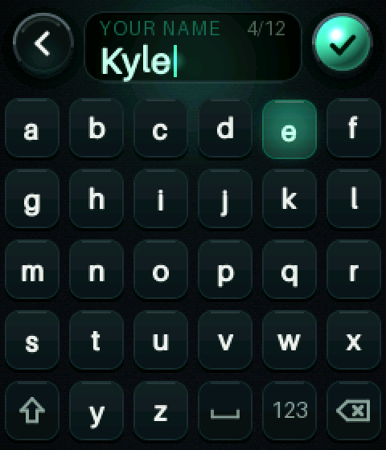
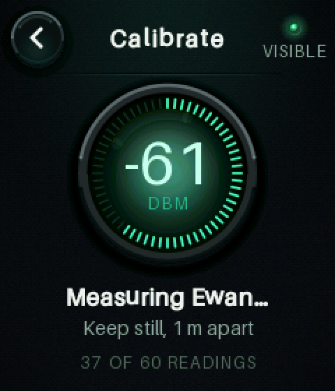

# Friend Radar

An EWatch app that spots friends' watches over Bluetooth LE, shows them as
blips on a sweeping radar by distance zone, and greets each *mate* who comes
near with a buzz and an animation that plays on both watches at the same
moment.

| Radar | A mate's card | The shared hello | Bump to celebrate |
|---|---|---|---|
|  |  |  |  |

| Menu | Mates | A mate's page | Name keyboard | Calibrate |
|---|---|---|---|---|
|  |  |  |  |  |

Version 1.1.0 is a visual redesign of 1.0.0 (same features, flows, settings
and radio protocol). See [What's new in 1.1.0](#whats-new-in-110-the-instrument)
and the side-by-side **[docs/compare_v1_v2.png](docs/compare_v1_v2.png)**.

This addon is a complete firmware: EWatch BaseOS (`dbe73c2`, MIT) plus the
Friend Radar app. The watch face, launcher, settings and sleep all work as in
stock BaseOS. Friend Radar is the first tile in the launcher.

---

## Using it

**Open.** From the watch face, swipe left to the launcher and tap **Friend
Radar**. The scope powers on: the rings grow out from the centre and the
sweep fades in. Lettering on the top of the bezel reads **VISIBLE AS \<YOUR
NAME\>** next to a green lamp while your watch is on the air. The first time,
set your name: **⋯** → **My name**.

**The scope.** You are the small lamp in the middle, sending out faint
ripples while you broadcast. Other EWatches running Friend Radar appear within
about a second:

* **Distance from the centre is the only real information.** The engraved
  grooves mark the zones *here* (< ~1 m), *near* (~1–3 m), *around* (~3–10 m)
  and *far*; their names are engraved along the bottom of the glass, in a
  sector no blip ever uses. Blips glide between grooves as the estimate
  changes.
* **The angle means nothing.** Bluetooth signal strength has no direction, so
  each watch keeps a fixed decorative spot on the dial, derived from its ID.
  The help page (**⋯ → How it works**) says the same.
* **Mates are glowing orbs in their own colour** (one of ten lights, derived
  from their ID, so both watches agree) with their initial and name. The halo
  breathes faster and brighter the stronger their signal. Other EWatches are
  small phosphor points, labelled when there are only a few. The sweep leaves
  a phosphor afterglow and makes each blip flare as it passes. A little moon
  means that watch was heard during a background window, i.e. it's asleep.
  Watches that go quiet turn into hollow rings, then fade away.

**Tap a blip** and the scope zooms in and locks onto it (brackets close round
it) while its card springs up from below: name, zone, approximate distance
(secondary text only), when it was last heard and signal bars. Tap the blip
again, an empty part of the scope or Back to let go.
* Not a mate: **Add as mate**.
* A mate: **Rename** sets a local nickname. **Remove** asks "Sure?" first.
  Tapping the card body opens the mate's page with the **Seen together** log.

**When a mate comes near**, both watches play the same "hello" inside the
scope's glass, which dims around it:
* two comets, one in each watch's own light, spiral in from the rim and bloom
  into a flower, with the other person's name set below it;
* a soft tick, then a *da-da-DUM* buzz as they bloom.

Every pair of mates gets its own petal count, colours and spin.

**Bump to celebrate.** When you're right next to a mate, both shake your
wrists within about 1.5 s. Both watches show *High five!* with two beating
hearts in your two colours, confetti that stays inside the glass like a snow
globe, and a triple buzz.

**Menu (⋯)**
* **Mates**: everyone you've saved, live status or "Seen 2 h ago". Tap one for
  their page.
* **My name**: on-screen keyboard: six big keys to a row in alphabetical
  order (every key is a full 40 × 44 px target), shift (auto-capitalises
  words), **123** for digits and symbols (including `'` and `-`), ✓ to save.
  The name appears in a small phosphor display between Back and ✓. Up to 12
  characters.
* **Calibrate distance**: see below.
* **Mate alerts**: a physical switch for the buzz and animation (default on).
  When off, your watch also ignores incoming hellos.
* **Background alerts** (default **off**) and **Check every** 30 s / 60 s /
  2 min: see [Power](#power-strategy-and-battery).
* **How it works**: short help.
* **New radar ID**: a fresh identity for privacy. Mates must add you again.

**Calibrate.** Wrists absorb a lot of signal, so a real 1 m reading makes the
zones much better. Stand an arm's length (1 m) from a friend whose radar is
open, both wearing the watches, screens facing. Tap **Measure with \<name\>**
and keep still for about 6 s (60 readings): each reading lights one of the
60 ticks round the gauge while the live dBm figure counts. **Save** stores the
median RSSI as your "1 m reference", which your beacon advertises. Do it on
both watches.

**Leaving.** Press the button, swipe right, or tap the back arrow. Back steps
out of cards and sub-pages (pages slide in from the right and back out again),
then out of the app. If a mate arrives while you are on another page, the
scope slides in for the shared animation and slides away afterwards; a tap
ends it early. The radio stops the moment
you leave. Holding the button for 3 s still powers the watch off.

The radar keeps the screen on while it's open. If you forget it: after 2 min
untouched the backlight dims, and after 15 min untouched the app closes and
the watch sleeps as usual.

---

## What's new in 1.1.0: the instrument

1.1.0 redesigns every screen; features, flows, settings and the radio
protocol are unchanged. One art direction runs through all of it: **a lit
sonar instrument** in a dark room. A gunmetal bezel catches a key light from
the top left; behind deep phosphor glass a single green light does all the
work; everything else is a few lamps, engraved caps and glass. The app owns
its palette (like a watch face would) instead of following the BaseOS theme,
so every page reads as part of the same object.

* **Scope.** Engraved grooves instead of flat rings, zone names set along the
  bottom arc where blips can't go (the old labels could collide with blips),
  a phosphor sweep with an afterglow that makes blips flare, film grain, an
  inner rim shadow and a curved glass reflection.
* **Mates are orbs** in their own light, with a halo that breathes with
  signal strength. Tapping one zooms the scope onto it (a spring camera) while
  its card springs up as a dark glass sheet.
* **Chrome.** Round glass buttons replace the BaseOS navy back button; status
  is lettering on the bezel and a lamp, not a pill.
* **Pages** are glass tiles with recessed icon wells, physical switches,
  orbs for mates, a timeline of meetings, a gauge whose ticks light up while
  calibrating, keycaps, and a phosphor display for typing. Pages slide in from
  the right and back out; toasts are glass capsules that rise from below.
* **Type.** Aileron in seven sizes (12 px engraved caps to a 44 px display
  face), tracked caps for labels, arc-set lettering on the bezel.
* **Bigger targets.** The keyboard went from 30 × 32 px keys to full 40 × 44 px
  cells (six to a row); every button is at least 40 px tall.

Side by side: **[docs/compare_v1_v2.png](docs/compare_v1_v2.png)**. All screens
and animation frames: `docs/previews/`.

---

## How it works

### The beacon
Each watch sends one non-connectable advertisement (`ADV_NONCONN_IND`) every
100 ms. It carries manufacturer data under company ID `0xFFFF`, the ID
reserved for testing:

* magic `EWR` and protocol version 1.0;
* a random persistent 4-byte watch ID;
* a calibrated 1 m RSSI;
* flags;
* a rendezvous clock byte;
* one event slot (wave / shake / celebrate, with a sequence number, a 16-bit
  target and an age);
* a display name of up to 12 characters.

Every advertisement uses a fresh random static address, so the chip's MAC
(shared with WiFi) never goes on the air. Scanning is passive, with
duplicates **not** filtered, so RSSI keeps updating at about 10 Hz per
watch. The full byte layout, decoding rules and an annotated example are in
**[docs/PROTOCOL.md](docs/PROTOCOL.md)**.

### From RSSI to a zone (`logic/fr_rssi`, `logic/fr_zones`)
1. **Filter.** For each watch, take a sliding median of the last 5 raw RSSI
   samples, then a time-constant EMA (τ = 1 s, α = dt / (τ + dt)). The median
   removes one-packet spikes and fades. The time constant makes smoothing
   behave the same at 10 Hz in the foreground and in bursts during a
   background window. Until the window has 5 samples the filter reports the
   running median, so one outlier can't steer the start. A 6 s gap restarts
   the filter.
2. **Distance model.** Log-distance path loss using the *sender's*
   advertised 1 m reference: `d = 10^((ref − rssi) / (10·n))`, with n = 2.5 for
   on-body indoor use. Distances are only ever shown as "~2 m"-style
   secondary text.
3. **Zones with hysteresis.** Boundaries sit at 0.7 m, 3 m and 10 m, compared
   in the path-loss domain. Crossing a boundary needs a 3 dB margin, and the
   new zone must persist 0.5 s when moving closer (prompt alerts) or 2 s when
   moving away (no flapping). The first fix is classified one hysteresis step
   farther than measured, so a noisy first packet can't fake proximity.
   **Lost** = nothing heard for 10 s. Lost blips fade from the dial after 60 s.

Tuning came from seeded simulations in `test/test_filter_zones` (5 dB raw
jitter):
* "Near" is declared about 2.4 s after a walking friend crosses 3 m.
* No zone flapping while standing still in any zone.
* No false "Near" from a friend standing at 6 m with up to 7 dB jitter.

The honest caveat: at about 5 m, around 1 % of five-minute stands briefly read
as Near. Body shadowing on real wrists will be worse than Gaussian noise.

### Alerts and cooldown (`logic/fr_alerts`)
A mate **arrives** when seen in Near or Right here after being away (not
near) for at least 90 s. An arrival alerts only if that mate's 10 min
cooldown has expired, and only after at least 5 packets.
* A friend sitting next to you buzzes you once.
* Hovering on a zone edge never re-triggers.
* Coming back within 10 min stays quiet.

Cooldowns live in RTC memory, so they survive deep sleep and carry across
foreground and background use.

### The shared animation (`logic/fr_handshake`)
1. A notices mate B arriving. It starts advertising a **Wave** event targeted
   at B (a fresh 6-bit sequence number), and starts its own animation 80 ms
   later, which is about the typical reception latency.
2. B hears the wave. If A is one of B's mates, B starts the **same**
   animation immediately. Both seed it from both IDs (order-independent), so
   the frames are identical. Only the caption differs: each shows the other's
   name.
3. If B hears the wave late (missed packets, or a background window), the
   wave's age byte lets B **join mid-animation** at the matching frame.
4. If both watches notice each other at once, each re-aligns to whichever
   started first when it hears the other's wave. A wave counts as B's alert
   too, so B doesn't fire a second one.
5. Only your own mates can make your watch buzz or animate (rate limited to
   one accepted wave per mate per 2 min).

**Bump to celebrate:**
* Each shake (BaseOS's `ImuMotion` jolt event) is advertised as an untargeted
  **Shake** event.
* A watch that sees its own shake and a mate's shake within 1.5 s, while
  that mate is right here, starts a celebration. It advertises **Celebrate**
  targeted at the mate.
* The mate joins if its wearer shook in the last 3 s, even if its own
  distance estimate disagreed. That keeps the outcome symmetric.

The handshake is pure code. `test/test_engine_sim` runs two complete engines
through the real codec over a simulated radio (path loss, ±4 dB noise, 2–107
ms latency, 10 % packet loss). It checks:
* one hello each;
* identical seeds;
* starts within 150 ms of each other;
* the cooldown behaviour;
* celebrations only when right here;
* strangers can't trigger anything.

### Mates and the encounter log (`logic/fr_mates`)
Up to 12 mates, each with a nickname and the last 6 **encounters**. An
encounter starts when a mate is heard after 5 min unheard, and records its
start, duration and closest zone. Mates are stored as a versioned blob in the
addon's own NVS namespace `friend-radar`, saved on every add, rename or
remove, and lazily (at most every 5 min, plus on exit) for sightings. BaseOS's
`ewatch` namespace is untouched.

### Rendering
All pixels come from a small software renderer (`gfx/`) that draws into the
shared `frameCanvas()`:
* anti-aliased circles, rings, arcs, lines, rounded rects, petals and glows;
* materials: lit spheres (orbs, lamps, switch knobs), soft drop shadows,
  gradient glass panels, film grain;
* alpha blending and dithered gradients, because RGB565 bands badly this dark;
* anti-aliased text baked from **Aileron** (Sora Sagano, dotcolon.net, CC0
  1.0) by `tools/bake_fonts.py`, in seven sizes from 12 px engraved caps to a
  44 px display face, plus text set along an arc (each glyph rotated and
  resampled);
* damped springs for every movement (`gfx/fr_motion.h`), stepped with real
  elapsed time so motion is frame-rate independent.

The scope is built once into PSRAM: the room, the instrument's drop shadow,
the gunmetal bezel (shaded per pixel with a key light, a reflected "window"
and concentric brushing), its engraved ticks and lettering, the phosphor glass
with grain and scan lines, and the overview's grooves. Two tables sit beside
it: a polar lookup for the sweep (no `atan2` per pixel; 16 px tiles the trail
cannot reach are skipped) and the glass overlay (inner rim shadow and the
curved reflection). Each frame copies the static layer, draws the moving
content through a camera (so the scope can zoom onto a mate), clips it to the
glass, lays the glass on top, then draws the bezel lettering, lamp and card.
The radar runs at 20 fps, the shared animations at 30 fps, and springs (card,
zoom, page slides, switches, toasts) at up to 60 fps while they move.

Because the renderer is plain C++, the same code renders the PNG previews on
a Mac (`tools/render_previews.sh`). The images in this README come from that
tool.

---

## Privacy

* **You are visible only while Friend Radar is open**, or during the short
  background windows if you switch background alerts on (off by default).
  The moment you leave, advertising stops.
* The bezel reads **VISIBLE AS \<NAME\>** next to a green lamp. The menu,
  mates, calibration and help pages show the same lamp with **VISIBLE** in
  the top right. With background alerts on, the watch face shows **Mate
  alerts on**.
* What goes on the air: your display name, a random watch ID, your 1 m
  reference, a coarse clock byte and the current event. No MAC, phone number
  or location.
* The watch ID is a stable identifier while you advertise. Anyone scanning can
  recognise your watch then. **⋯ → New radar ID** replaces it.
* Beacons are not authenticated. Someone could copy a mate's ID. The worst
  case is a spurious hello, rate limited per mate.

---

## Power strategy and battery

These are **estimates** from typical ESP32-S3 module figures. Nothing here
has been measured on an EWatch yet (see the hardware checklist). Battery life
below assumes a **300 mAh** cell; scale linearly for the real one.

### Foreground (radar open)
* Auto-sleep is blocked while the app is open (`blockSleep` in `taskRender`).
* Scanning runs at ~95 % duty and advertising every 100 ms at +9 dBm.
* The dial redraws at 20 fps.

| Item | Estimate |
|---|---|
| CPU 240 MHz, rendering ~60 % of the time | 40–50 mA |
| BLE receive, ~95 % scan duty | 40–55 mA |
| BLE transmit, ~1.5 ms per 100 ms at +9 dBm | ~2 mA |
| Display, backlight at default brightness | 20–30 mA |
| **Total** | **~100–135 mA → roughly 2–3 h of continuous radar on 300 mAh** |

Dimming after 2 min untouched saves ~15 mA, and the app closes after 15 min
untouched. Leaving the app stops the radio at once. The BLE controller is
shut down entirely 20 s later.

### Background mate alerts (stretch goal; build flag and setting)
**Compiled in** with `-DFR_BACKGROUND_ALERTS=1` (in `platformio.ini`).
**Enabled** only with **⋯ → Background alerts** (default off).

When the watch goes to sleep with background alerts on, at least one mate
saved, and battery at 15 % or more:

1. `enterDeepSleep()` arms a timer wake for the next **rendezvous slot**
   instead of the stock 30 s auto power-off. That stops the power-off from
   killing it; the watch never powers off by itself in this mode.
2. On the timer wake, `setup()` runs a **headless window** before the display
   is touched: read the RTC and battery, bring up NimBLE, then advertise
   (every 60 ms) and scan for 3.5 s.
3. If a mate is near (zone Near or closer, at least 5 packets), or a mate's
   wave addressed to us is heard, the watch **boots fully**. It buzzes, opens
   the radar and plays the shared animation (joining mid-way if needed). It
   goes back to sleep 25 s after the animation unless touched.
4. Otherwise it deep-sleeps straight away until the next slot. Touch or button
   during a window boots the watch normally.

**Rendezvous.** Two sleeping watches only hear each other if their windows
overlap. So windows open at the same wall-clock instants:
* Slots are multiples of the period in *radar time* (RTC + a learned offset).
* Each window opens 1.5 s before the slot.
* A sub-second estimate of the RTC phase is kept against the deep-sleep-proof
  system clock, refined from RTC second rollovers.
* Mates converge on the lowest-ID mate's clock via the beacon's clock byte.

Mates who have met in the foreground (as they must have, to add each other)
end up aligned within about a second. Their windows overlap by 2 s or more.
* **Detection latency:** up to one period (60 s by default) plus ~1 s boot.
* **If one watch's clock jumps later** (manual change, NTP correction): the
  two may stop overlapping until they next meet with the app open.

**Cost per window**

| Item | Charge |
|---|---|
| Boot to radio on, ~0.45 s at ~45 mA | ~20 mA·s |
| Window, 3.5 s at ~85 mA | ~300 mA·s |
| **Total** | **~320 mA·s ≈ 0.09 mAh** |

| Period | Windows/hour | Radio average | Plus sleep floor* | 300 mAh lasts |
|---|---:|---:|---:|---:|
| 30 s | 120 | ~10.7 mA | ~12–13 mA | ~1 day |
| **60 s (default)** | 60 | ~5.3 mA | ~7 mA | **~1.5–2 days** |
| 2 min | 30 | ~2.7 mA | ~4.5 mA | ~2.5–3 days |

\* **Sleep floor.** With background alerts on, the watch stays in deep sleep
instead of powering off, so the board's sleep current now matters:
* ESP32-S3 ~10 µA;
* MMA8451 up to ~165 µA if IMU wake is on;
* CST816S scanning for touch wake, likely 1–2 mA;
* LDO quiescent current.

This is estimated at 1.5–2 mA and is **unmeasured**. To keep it down, this
firmware now puts the ST7789 into its sleep mode (SLPIN) before every deep
sleep. Below 15 % battery, background mode stands down and the stock power-off
applies again.

---

## Limitations

* **Distance is a guess.** Bodies, pockets, walls and which way you face can
  shift RSSI by 10–20 dB, so a friend behind you may read one zone farther.
  Calibration helps. Zones are deliberately coarse.
* **No direction.** Blip angles are decorative, by design and by physics.
* **Verified only by compiling, host tests and host-rendered previews.** No
  radio, timing or current figure has been measured on an EWatch.
* Background mode needs mates' clocks to agree (they converge when you meet).
  Detection in the background can take up to one period. It costs real
  battery and is off by default.
* A touch during a 3.5 s background window may not be noticed until the
  window ends. The button always works.
* Beacons are unauthenticated test-range manufacturer data (`0xFFFF`), not a
  registered company ID.
* Coexists with BaseOS WiFi (software coexistence). With WiFi active the
  radar receives fewer packets.
* At most 16 nearby EWatches tracked and 12 mates saved. Names are printable
  ASCII only.

---

## Build, test, preview, package

From the repository root:

```sh
~/.platformio/penv/bin/pio run -d addons/Friend_Radar               # firmware (env:ewatch)
~/.platformio/penv/bin/pio test -d addons/Friend_Radar -e native    # 86 host tests, 6 suites
addons/Friend_Radar/tools/render_previews.sh                        # PNGs -> docs/previews/
python3 tools/package_addon.py addons/Friend_Radar                  # build + package into dist/
python3 addons/Friend_Radar/tools/bake_fonts.py                     # regenerate the UI fonts
```

* **Serial diagnostics** (optional, 115200 baud): type `radar` for identity,
  radio state, every nearby watch (RSSI, zone, path loss, sample count),
  background window counts and heap. Use `~/.platformio/penv/bin/pio device
  monitor`.
* **Frame timing:** build with `-DFR_PERF_LOG=1` and the app prints average
  draw and flush times and the frame rate to serial every 5 s.
* **Kill switch:** set `-DFR_BACKGROUND_ALERTS=0` in `platformio.ini` to
  compile background alerts out entirely. The watch then behaves exactly like
  stock BaseOS whenever the app is closed.

---

## Hardware test checklist (two watches)

You need watches **A** and **B**, both flashed and charged, with their clocks
set (ideally via WiFi NTP). A phone with a BLE scanner app (e.g. nRF Connect)
and a USB serial monitor help.

1. **Launch.** "Friend Radar" is the first launcher tile. The scope powers
   on; the bezel reads "STARTING RADIO" with an amber lamp, then "VISIBLE AS
   EWATCH XXXX" with a green lamp within ~1 s. The toast "Set your name in the
   menu" rises from the bottom. No crash-recovery screen on any later boot.
2. **Names.** ⋯ → My name → type "Ana" on A and "Ben" on B, then ✓. The bezel
   updates. Typing is responsive and shift auto-capitalises.
3. **Discovery.** Both radars open, 3 m apart. Each shows the other as a
   phosphor point within ~2 s. Footer: "1 nearby · tap a dot to add a mate".
   Serial `radar` shows samples rising about 10/s and `dropped 0`.
4. **RSSI survey** (for tuning, please record the numbers). On wrists, facing
   each other, take a `radar` reading at 0.3, 1, 2, 3, 5, 10 and 20 m.
   Repeat with one person turned away. Note the zone each time.
5. **Zone behaviour.** Walk B from 15 m to 1 m and back slowly: zones step
   Far → Around → Near → Right here and back without flicker. Standing still at
   2 m and at 6 m for 2 min, the zone must not flap.
6. **Calibrate.** Exactly 1 m apart: ⋯ → Calibrate → Measure. Expect a result
   between −50 and −75 dBm with a spread of 10 dB or less. Save. Repeat on B.
   B's `radar` output shows A's new reference.
7. **Add mates.** Tap B's dot on A: the scope zooms onto it and the card
   springs up → Add as mate → toast. The dot becomes a glowing orb with "B",
   in the same colour on both watches. Repeat on B. Check Rename, the
   keyboard, and Remove (needs "Sure?").
8. **Arrival alert and sync.** Separate by more than 20 m for at least 2 min,
   then walk together. Within ~2 m, both watches tick then buzz da-da-DUM and
   play the same flower bloom with the other's name. **Film both screens in
   one slow-motion shot.** Starts should differ by 150 ms or less, with the
   same petal count and colours.
9. **Cooldown.** Separate and rejoin within 10 min: no alert. After 10 min
   apart: alert again.
10. **Celebrate.** Right here (< 0.5 m): both shake within ~1 s → both show
    "High five!" in sync with a triple buzz. One shake alone, shakes over 2 s
    apart, or shakes at 3 m → nothing.
11. **Encounter log.** Tap a mate's card body (or Mates → name). "Seen
    together" lists today's encounter with duration and closest zone. Reboot:
    still there.
12. **Privacy.** With the radar open, the phone scanner shows manufacturer
    data `FF FF 45 57 52 10 …` from a random address. The address changes each
    time the app is reopened. Leave the app → the beacon disappears within ~1 s.
13. **Idle guard.** Leave the radar untouched: the backlight dims at 2 min.
    At 15 min it returns to the watch face, then sleeps.
14. **Frame time (v1.1.0).** Build with `-DFR_PERF_LOG=1`, open the radar
    with a few watches around and read the serial line: draw + flush should
    stay under 50 ms (20 fps) on the dial and the springs should look smooth
    (card, zoom, page slides). Note the numbers for tuning.
14. **Navigation.** Back button, right swipe and the back arrow all step back
    correctly from every page. Lists scroll by dragging.
15. **Radio cycling.** Open and close the app 10 times, waiting over 20 s
    between, so the serial log shows "radio powered down". No crash, and free
    heap (`radar`) stays stable.
16. **WiFi coexistence.** Settings → WiFi on (client, connected): the radar
    still finds the other watch. No crash.
17. **Sleep and wake** with background alerts **off**: the watch powers off
    30 s after sleeping, as stock. Wake by touch/button: the display comes
    back correctly (panel SLPIN change).
18. **Background alerts.** Turn them on for both, with a 60 s period. The
    watch face shows "Mate alerts on". Let both sleep while far apart.
    * Serial shows "radar bg: window N done, next in … ms" about every 60 s.
    * The watches do **not** power off after 30 s.
    * Bring them within 2 m: within about 75 s both wake, buzz and play the
      hello (one may join mid-animation).
    * Untouched, both sleep again ~25 s after the animation.
19. **Background power.** Measure on the battery lead (USB meters read the
    charger):
    * the deep-sleep floor between windows;
    * the window current;
    * 24 h drain at a 60 s period.

    Compare with the table above and update it.
20. **Background edge cases.**
    * A touch or button press during a window boots the watch normally within
      ~3.5 s.
    * Below 15 % battery, the background stands down and the watch powers off
      after 30 s asleep.
    * Change one watch's clock by 30 s: background meetings may stop until
      both open the radar together once. Serial shows "rendezvous clock ±N s".

---

## Credits

* EWatch hardware and BaseOS by Ewan Wills, MIT licence (see `LICENSE`).
* UI font: Aileron Regular by Sora Sagano (dotcolon.net), CC0 1.0, as bundled
  with Pillow.
* Code, artwork, icon and text: original to this addon.
