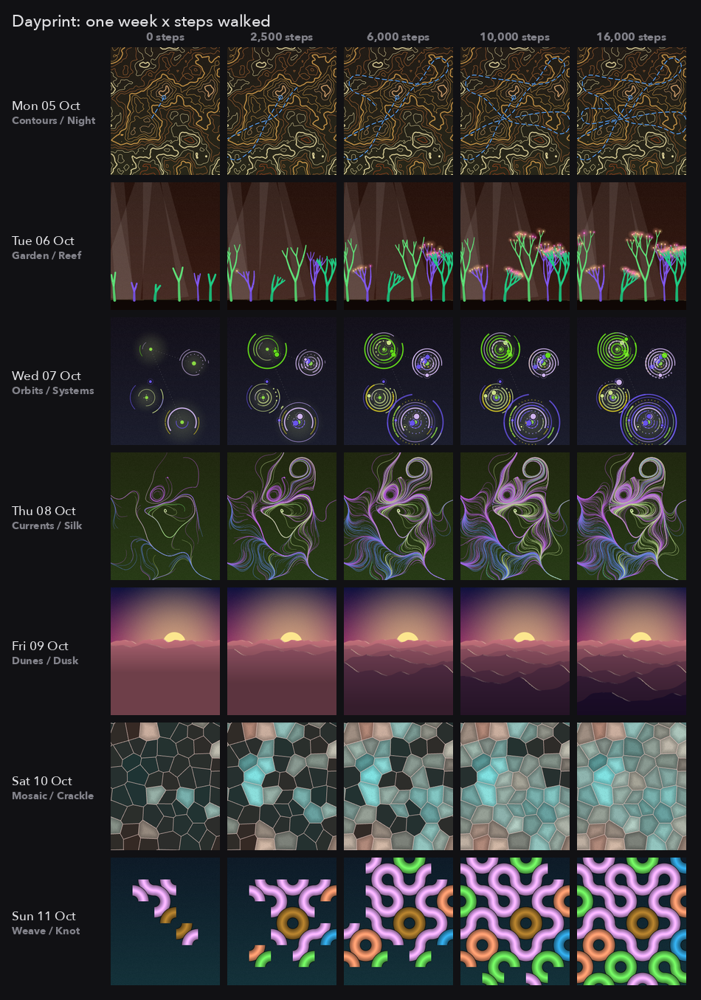
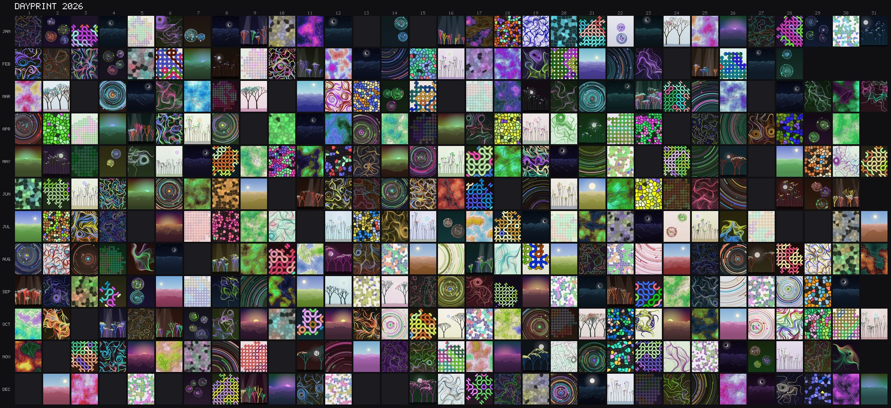
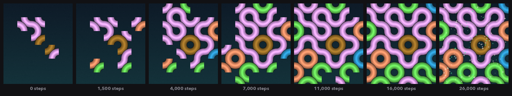
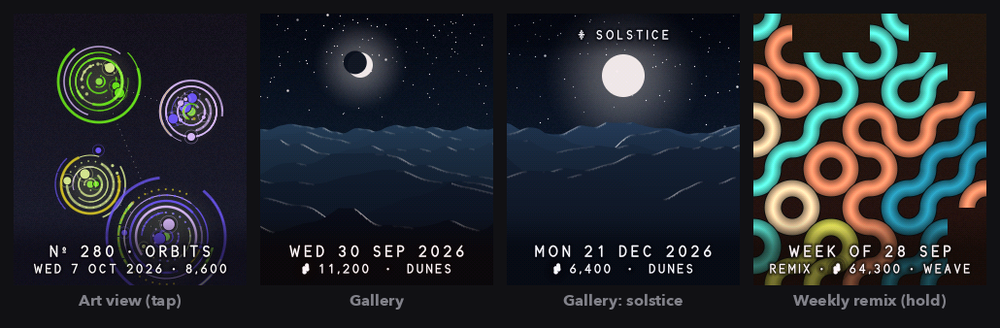

# Dayprint

**A new artwork every day, grown by your steps.** Dayprint is a generative
watch face for the EWatch. The date picks today's composition, palette and
every parameter; your steps grow the piece through the day. No two days look
the same, and every day is kept, so the watch slowly fills with a year-long
collection you can browse on the wrist or export as PNGs.


- Addon id `generative-face`, type `watchface`, built on EWatch BaseOS @ `dbe73c2`.
- Seven composition families, each with three variants: **Currents** (flow-field
  strokes), **Orbits** (arcs and planets), **Weave** (Truchet tiles), **Garden**
  (branching plants), **Contours** (a topographic map with your walk drawn on it),
  **Mosaic** (Voronoi glass) and **Dunes** (layered ridges under a sun or moon).
  Every Monday-to-Sunday week shows all seven in a shuffled order.
- Steps keep counting with the screen off (light sleep, accelerometer FIFO),
  with an on-device step detector tested against synthetic walking, running,
  typing, car rides and arm waving.
- **Gallery** app: browse past days, re-rendered from their records; hold for
  the week's **remix**.
- `tools/snap.py` saves any day as a PNG over USB and builds a year poster.



## Using it

**The watch face**

| Gesture | What it does |
|---|---|
| swipe left or up | open the launcher (Gallery, System) |
| swipe down | open the Gallery |
| tap | art view: hide the clock and show a museum-style label (Nº and family); tap again or press the button to return |
| long press | Face settings |
| hold the button 3 s | power off (BaseOS) |

The time sits in the upper half with the date under it; today's steps and a
thin goal line sit at the bottom. The text picks light or dark ink from the
art behind it and floats on a soft scrim and halo, so it stays legible on
every family. A low-battery glyph appears at the top below 10 %.

When the watch wakes, the face is already there. After a deep-sleep reboot
(see Power), the clock shows at once and the artwork blooms in over about a
second. Each 250 steps adds to the piece: more strokes, arcs, tiles, branches,
lit glass, ridges, or a longer trail. Growth eases out and the piece is
complete at 16,000 steps; beyond that, small glints are added up to 40,000.

**The Gallery** (launcher tile, or swipe down on the face)

| Gesture | What it does |
|---|---|
| swipe up / down | an earlier / a later day (today is first) |
| tap | hide or show the label |
| long press | this week's remix: a new piece from the family of the week's most-walked day, a palette around the week's average hue, grown by the week's average steps |
| button or swipe right | back |

The first time you open the Gallery it may say "Preparing the gallery…" for a
few seconds while the flash partition is formatted (once).

**Settings → Face**

| Setting | Default | Notes |
|---|---|---|
| Watch face | Dayprint | "Classic" brings back the stock BaseOS face; its styles are under Settings → Font |
| Steps when dark | On | background counting; Off restores the stock sleep and auto power-off and counts only while the screen is on |
| Daily goal | 8k | off, 2,000 to 30,000; a short buzz pattern when reached |
| Light of day | On | warms the art at dawn and dusk and cools and dims it at night (display only; stored art is unchanged) |
| Drifting light | On | a slow, subtle glow that drifts across the face while it is on |

Special days get a twist: New Year's Day has a gold-on-midnight palette; the
June solstice is a dune landscape under a big sun; the December solstice has
a full moon over night dunes; the equinoxes and solstices are named in the
label.

## Saving the collection (snapshots)

Every day at midnight the watch files a record (date, final steps, algorithm
version). The records take 8 bytes each; the file holds up to 1,100 days
(three years), about 9 KB, on the LittleFS partition at
`/generative-face/days.bin`. Art is re-rendered from records, so nothing
large is stored.

The collection is the point, so nothing throws it away. Saves go to a temp
file that is renamed into place, so a power cut mid-save keeps the old file
or the new one. A file that fails its checksum is salvaged record by record
and the original kept as `days.bad`. The partition is formatted only on
first use; after that, a failed mount must repeat on three separate boots
before it is reformatted, so a one-off glitch can't wipe it. If the
collection can't be written, closed days wait in NVS (up to eight) and are
filed later, and the Gallery says "COLLECTION UNAVAILABLE".

With the watch connected over USB (it keeps the console alive while a
computer is attached, even with the screen dark):

```sh
PY=~/.platformio/penv/bin/python      # has pyserial; or: pip install pyserial
$PY tools/snap.py now                  # the current face -> snaps/face-<time>.png
$PY tools/snap.py day 2026-10-01       # one day with its label
$PY tools/snap.py day 2026-10-01 --plain   # the bare artwork
$PY tools/snap.py list                 # every recorded day
$PY tools/snap.py year 2026 --plain    # all of 2026 -> snaps/2026/*.png + poster
$PY tools/snap.py sheet snaps/2026 2026    # rebuild the poster from saved PNGs
```

The poster lays the year out as a calendar, one row per month:



Snapshots are rendered on the watch, not captured from the screen, so they
are exact at any time. A day takes about a second to render and stream. The
serial protocol is documented in `src/core/console.h`.

## How it works

### Determinism

The artwork is a pure function of (day, step bucket, `ALGO_VERSION`):

- A 64-bit seed comes from the day index (days since 2000-01-01) and the
  algorithm version. PCG32 generators seeded through SplitMix64 drive
  separate streams for the spec, the family parameters, the growth elements
  and the flourish. `random()` and `esp_random()` are never used.
- All art maths is integer or fixed point: positions in Q8, sin/cos from a
  frozen 1024-entry Q14 table, integer square roots, and fixed-point gradient
  noise. No floats, no `long`, no library sorts, and never two random draws
  in one expression (C++ leaves their order unspecified). The rules are at
  the top of `src/art/gf_core.h`.
- Rendering is a fixed sequence of small ops. Raising the step bucket only
  appends ops, so the watch extends a piece instead of redrawing it, and
  chunked rendering gives exactly the same pixels as a one-shot render (both
  are tested).
- `ALGO_VERSION` (1) is stored in every record. Twenty-one golden hashes in
  `test/test_art` freeze version 1. Future changes must add version 2
  alongside it, never edit version 1.
- On the watch, `ARTHASH 2026-10-01 8000` prints the same fingerprint as
  `tools/preview/preview hash 2026-10-01 8000` on a Mac. That's the
  cross-compiler check to run on hardware.

### Composition

- **Schedule**: each Monday-based week is a seeded shuffle of the seven
  families; a week never starts with the family that ended the previous one.
  The variant comes from the day's seed.
- **Palette**: HSL harmony schemes (analogous, complementary,
  split-complementary, triadic, tetradic, monochrome) around a base hue that
  drifts through the year (icy blues in January, greens in spring, warm
  oranges in summer, rust and plum in autumn) plus wide daily randomness.
  Inks are nudged until their luma clears the background, for real value
  contrast. The year poster shows the seasonal drift.
- **Growth**: `growth = 1 - (1 - b/64)^2` over 250-step buckets `b`, so early
  steps show quickly and the piece completes at 16,000 steps.
- **Families**: each is five functions (init, prep count, prep op, element
  count, element op). See `src/art/gf_family.h` and `CLAUDE.md` for adding
  one.



### The face

`src/art/gf_face.cpp` composes art, a soft scrim, a three-step halo and the
text into RGB565 with 4×4 ordered dithering (no banding on gradients). The
type is an original monoline stroke font (`src/art/gf_font.cpp`) rendered
anti-aliased at any size. The time is 60 px tall. On the watch the art job
runs in 8–25 ms slices per render call (the short slice when that call also
composes and flushes a frame), and frames are composed at most every 90 ms
while blooming. No call holds the render task for much over 40 ms, so input
stays responsive. A test renders a year of faces and checks the clock's
contrast against its halo: the worst of the year is 176/255.



### Step counting

`src/core/steps.cpp` (pure C++, host-tested):

1. |a| in g from the MMA8451 at 50 Hz.
2. Gravity removed by a 0.5 Hz baseline.
3. 3 Hz Butterworth low-pass.
4. One candidate per positive half-wave of the signal, timed at its peak,
   above an adaptive threshold.
5. Intervals of 0.25 to 2 s.
6. A regularity gate: a bout is credited only once five peaks arrive in a
   consistent rhythm, then retroactively, so jolts, typing and most car bumps
   never count.
7. Stride awareness: at the wrist, arm swing often hides every other
   footfall, so an interval of about twice the cadence counts as two steps.

Measured on synthetic signals: normal and slow walking 99%, running 99%,
twelve randomised walkers all within 4.4%, typing 0 steps in 3 minutes, a
5-minute car ride 7 false steps, arm-waving bursts 5 false steps in 2
minutes, single jolts 0.

## Power

Stock BaseOS deep-sleeps after 5 s and powers itself off after 30 s asleep, so
nothing runs in the background. Dayprint replaces that (switchable in
Settings → Face, and at build time with `-DGF_BG_STEPS=0`):

| Tier | When | What runs | Wakes on |
|---|---|---|---|
| Screen on | in use | 240 MHz, art blooms, face redraws | — |
| 1 · Moving | screen dark | light sleep at 80 MHz; panel asleep (RAM kept); accelerometer FIFO wakes the CPU every 0.6 s to count steps | touch, button, FIFO, 15 s timer |
| 2 · Still | 90 s without steps (25 s after a motion wake) | light sleep; FIFO wake disarmed | touch, button, motion (≈0.19 g), 15 s housekeeping timer |
| 3 · Deep | 15 min still | deep sleep; touch controller powered down; accelerometer at 12.5 Hz | button, motion (≈0.25 g). A motion wake reboots quietly with the screen dark and goes back to tier 1. A 4-hourly timer checks the battery and sleeps again |

Each 30 s, the clock is read: midnight rollover files yesterday, NVS
checkpoints run every 300 steps or 5 minutes, and the goal buzz fires. A
low-battery cutoff powers the watch off after three readings below 3.35 V a
minute apart, or two 4-hourly checks during deep sleep, so a watch left in a
drawer turns itself off instead of running flat (`-DGF_LOWBAT_CUTOFF_MV`, 0
disables it). Wake-storm guards stop
a stuck interrupt line from pinning the CPU awake: a chattering FIFO
interrupt drops to tier 2, a chattering touch line is muted for a minute, a
motion line that stays high after it is cleared is muted for the rest of
that screen-off (so it can't hold off deep sleep), and unexplained wakes
fall to deep sleep. The button always wakes the watch. While a computer is
attached over USB, sleep is simulated so the serial console keeps working.
Powering off (3 s hold, Power → Off, low battery) leaves the task watchdog
first and waits for the button to be released, so a held button can't
reboot the watch straight back on.

**Battery estimate** (from datasheet typicals, not measured; please measure):

| State | Estimated current |
|---|---|
| Screen on | 45–60 mA |
| Tier 1 (moving) | 0.6 mA + touch controller scan (0.1–2 mA, the big unknown) |
| Tier 2 (still) | 0.4 mA + touch controller scan |
| Tier 3 (deep) | about 0.05 mA |

For a day with 8 minutes of screen time, 2 hours walking, 14 hours sitting
(half fidgeting) and 8 hours asleep, that's about **20–50 mAh per day**.
Stock BaseOS, which powers off when idle, uses about 8 mAh for the same
screen time. Every 100 mAh of battery is roughly 2–5 days with background
counting. The CST816S scan current dominates; if it's high on hardware,
powering the touch chip down in tier 2 (button wake only) is a small change.

## Limitations

- Nothing has run on hardware yet. The accelerometer FIFO, light-sleep wake
  sources, panel sleep timing and real step accuracy are all unverified (see
  the checklist).
- Steps are lost at the start of each walk while the detector qualifies a
  rhythm (five steps, credited once qualified) and for about 1–2 s after a
  deep-sleep motion wake (boot time).
- Arm movements with a steady rhythm (sustained waving, some sports) can
  count as steps, as on most wrist pedometers. Some car rides add a few false
  steps.
- The day changes at local midnight as the RTC sees it: no time zones or DST
  (as in BaseOS). Setting the clock backwards carries today's count into the
  earlier date.
- Equinox and solstice dates are UTC, 2020–2099.
- WiFi (NTP time sync, web settings) is compiled out
  (`-DEWATCH_ENABLE_WIFI=0`). Set the time under Settings → Time/Date.
- With background steps on, the stock "Sleep → off" timeout and "Wake on IMU
  jolt" settings don't apply (the watch stays in a counting sleep instead).
- In tier 3 the screen doesn't wake on touch (the touch chip is off). Press
  the button, or pick the watch up and then tap.
- A piece's first bloom after a deep-sleep reboot takes about 0.2–1 s
  (Currents Silk is the slowest).

## Build, test, package

```sh
# from the repo root (ewatch/)
~/.platformio/penv/bin/pio run -d addons/Generative_Face            # firmware
~/.platformio/penv/bin/pio test -d addons/Generative_Face -e native # 46 host tests
python3 tools/package_addon.py addons/Generative_Face               # build + dist/

# host previews (from addons/Generative_Face/)
tools/preview/build.sh                                  # clang++ build of the watch's art code
tools/preview/preview face 2026-10-01 6000 10:42 out.png
tools/preview/preview art 2026-10-01 6000 out.png
tools/preview/preview grid 2026-10-05 7 0,3000,9000,16000 grid.png face
tools/preview/preview hash 2026-10-01 8000              # compare with the watch's ARTHASH
python3 tools/preview/make_docs.py                      # regenerate docs/
```

Build gates in `platformio.ini`: `GF_BG_STEPS` (1 = background counting
compiled in), `GF_LOWBAT_CUTOFF_MV` (3350; 0 disables), and
`EWATCH_ENABLE_WIFI` (0).

## Hardware test checklist (Kyle and Ewan)

Plug in over USB, open a serial monitor at 115200 and type `HELP`.

1. **Boot and face**: the face appears with the time, then the art blooms in
   within about a second. Swipe left and swipe up both open the launcher;
   swipe down opens the Gallery; a long press opens Face settings; a tap
   toggles the art view.
2. **Determinism on silicon**: `ARTHASH 2026-10-05 0`, `ARTHASH 2026-10-11
   9000` and `ARTHASH 2027-01-01 5000` must print `4e28e05b`, `8a4e5b83` and
   `7a1dd9ef`. Every case is in `test/test_art/golden.inc`. A mismatch means
   the watch's compiler disagrees with the host; please send the output.
3. **Step accuracy**: `STEPS` shows the count. Walk 200 counted steps
   indoors, 500 outdoors and a short run; compare (expect within about 5%).
   Then type for two minutes, ride in a car, and wave your arms: little or
   nothing should count.
4. **Background counting**: with USB unplugged, let the screen go dark, walk
   300 steps, then tap to wake. The count should include them, and the piece
   may visibly grow.
5. **Sleep tiers**: unplug, leave the watch still on a table; after about 16
   minutes it should be in deep sleep (touch no longer wakes it, the button
   does). Pick it up and walk: steps should resume after a few seconds. After
   a while, plug in and send `PWR` for counters.
6. **Wake behaviour**: from each tier, check a tap and a button press. Note
   the time to a lit face (target under 150 ms from light sleep). Check that
   the waking tap doesn't toggle the art view. Also sleep the watch by hand
   (System → Power Off → Sleep, or the classic face's power icon), wait
   longer than the sleep timeout, press the button once: it should wake and
   stay awake.
7. **Panel**: no flash of stale content on wake. If the ST7789 doesn't keep
   RAM through SLPIN on this panel, you'll see garbage; report it.
8. **Midnight**: set the time to 23:58 with steps on the counter. After
   midnight, `DAYS` lists yesterday and the count restarts at 0. The Gallery
   shows yesterday.
9. **Snapshots**: `~/.platformio/penv/bin/python tools/snap.py now`, `day
   <yesterday>` and `year 2026` produce PNGs and a poster.
10. **Battery**: measure current in tier 1, tier 2 and tier 3 (and with
    "Steps when dark" off) and update the estimate above. If tier 2 is
    dominated by the touch controller, consider powering it down there.
11. **Low battery**: on a nearly flat battery the watch should power off
    cleanly; the count survives (NVS).
12. **Fallback**: build with `-DGF_BG_STEPS=0`; the watch behaves like stock
    BaseOS (deep sleep, power-off) and counts only while the screen is on.
13. **Classic face**: Settings → Face → Classic; the stock face works and
    redraws after sleep; Settings → Font changes its style.
14. **Power off and on**: hold the button for 3 s and keep holding it for
    another 25 s; the watch must stay off after you let go (no reboot). Turn
    it on; today's count and the collection are intact.
