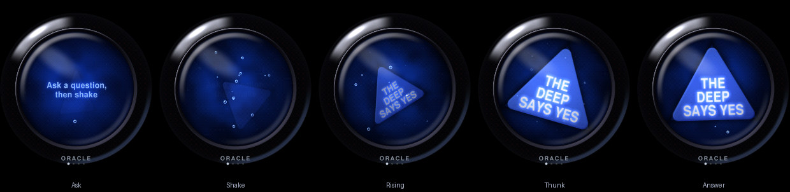
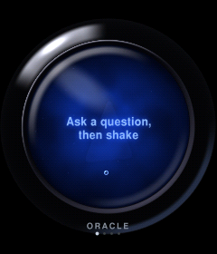
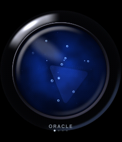
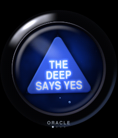
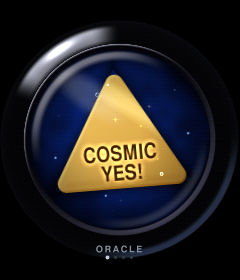

# Shake Oracle

*Ask a question, shake your wrist, and a glowing die rises from the deep with
your answer.* An app addon for the EWatch: a complete firmware made of EWatch
BaseOS (`dbe73c2`) plus one app, installed from EWatch Cloud over USB.



| Idle | Shaking | Answer | Golden |
|---|---|---|---|
|  |  |  |  |

An animated version is in [`docs/oracle.gif`](docs/oracle.gif). Every image
here is rendered on a computer by the same C++ the watch runs (see
[Host previews](#host-previews)).

## Why "Shake Oracle"

"Magic 8 Ball" is a Mattel trademark, so this addon uses an original name. It
says what the app is (an oracle) and what to do with it (shake), so it's
easy to find on the marketplace. The id is `shake-oracle`. Everything in the
app is original: the artwork, the code and all 80 answers, none of which is
taken from the toy (a unit test checks this against hashes of the toy's
answers, so this repo never stores that text).

## Using it

1. From the watch face, swipe left to open the launcher. **Shake Oracle** is
   the first tile.
2. Ask your question, out loud or in your head. The liquid shows a prompt.
3. **Shake** the watch firmly: three or four quick back-and-forth flicks. The
   die starts tumbling in the murk and you feel a soft rumble.
4. **Stop and hold still.** About half a second later the die floats up,
   knocks against the glass (a crisp *thunk*) and wobbles to rest with your
   answer.

| Gesture | What it does |
|---|---|
| Shake, then hold still | Churn, then reveal an answer |
| Press and hold the glass, then let go | The same without shaking: hold to churn, release to reveal (handy if shaking is hard, or the accelerometer fails) |
| Tap | Clear the answer (the die sinks back into the dark). With no answer showing, a tap blows a few bubbles. |
| Swipe up / down | Next / previous answer pack. The name under the glass and the prompt change. |
| Swipe right, or press the button | Back to the launcher |
| Hold the button 3 s | Power off (as everywhere on the watch) |

**Answer packs** (your choice is remembered):

| Pack | Answers | Golden answer |
|---|---|---|
| ORACLE | 9 yes, 9 maybe, 9 no, plus 3 rare surprises | "Cosmic YES!" |
| YES / NO | 8 yes, 8 no | "Biggest YES ever" |
| FOOD | 18 dinner ideas | "Dessert first!" |
| EXCUSES | 16 excuses | "Try the truth. Wild!" |

About one shake in 60 rolls the pack's **golden answer**: a gold die with
sparkles and a little haptic twinkle. Rare surprises come up about 1/8 as
often as a normal answer. The same answer never appears twice in a row, even
across sleep or when you switch packs (`Nope` is in two packs).

The screen stays awake while the app is open: at least **45 s** after your
last tap or shake (longer if your Settings > Sleep timeout is longer;
"never" stays never). It dims for the last 8 seconds, so you can tell it's
about to sleep.

## Design notes

### The look

- **The ball** fills the screen: glossy black, with a soft-box reflection
  arcing over the upper left, a cool rim light lower right, and a recessed
  bevel around the glass. It's lit as a real sphere would be: only the outer
  ring shows, and that ring reflects light from beside and behind the ball.
  Rendered once per boot, then cached.
- **The liquid** is deep blue with a light pool, a vignette and the rim's
  shadow. Two layers of tileable noise give it murk. One drifts, the other
  rotates as a swirl that spins up when you shake and keeps turning for a
  couple of seconds after you stop. Fine sediment motes ride the swirl.
- **The die** is an equilateral triangle with rounded corners, a lit face and
  a rim catching the light. Depth works like a real die rising through ink: as
  it rises it grows (perspective), clears (fog) and sharpens. While churning
  it tumbles in 3-D (a foreshortening squash) and spins. The answer is blank
  until it rises.
- **Text** is set in caps from the BaseOS FreeSans Bold 24 pt font. It's
  scaled down with an exact area-weighted box filter, so it is anti-aliased at
  any size, condensed to 85 %, word-wrapped into the triangle with every line
  centred, and shrunk to fit. All 84 answers (including the golden ones) fit
  at 10.2 px caps or larger (the floor is 9 px), and a soft glow keeps them
  legible.
- **Bubbles** rise toward the high side of the glass, wobble, ride the swirl,
  burst out when the shake starts and squeeze out around the die when it hits
  the glass.
- **Tilt.** The die is buoyant, so it drifts toward the high side of the glass
  as you tilt your wrist (like a spirit-level bubble), then slowly recentres.
  The reflection on the glass shifts the other way for a little parallax.
- **Colour**: everything is mixed at 8.8 fixed point and ordered-dithered to
  RGB565, so the dark gradients don't band on the panel.

### Animation and physics (`core/oracle_scene.cpp`)

A small state machine: *Idle → Churning → Rising → Showing → Sinking*.

- **Rising** is buoyancy against drag (it accelerates, then glides), with the
  glass as a floor and restitution. The first contact fires the thunk, a 3 %
  "pop", a face flash and a puff of bubbles. The die turns to face you on a
  damped spring (ζ ≈ 0.3, a few visible wobbles), and its 3-D tumble settles
  flat.
- **Churning** is sloshing: the liquid lags the watch, so the die is pushed
  opposite to your shake. It also tumbles, wanders randomly and bobs in depth.
- All physics is sub-stepped (≤ 8 ms) so it's stable at any frame rate, and
  it's deterministic for a given seed and input, so tests and previews run
  exactly what the watch runs.

### The shake detector (`core/shake_detector.cpp`)

Every accelerometer sample `taskIO` reads (about 45 Hz, timestamped) reaches
the app through a lock-free ring (`core/imu_stream.*`). The detector:

1. Removes gravity with a time-constant-correct low-pass (τ = 0.3 s), then
   looks at the dynamic acceleration vector `d`.
2. A **lobe** is a run of samples with |d| ≥ 0.9 g in one direction. A lobe in
   roughly the opposite direction (cos ≤ −0.35) is a **reversal**.
3. **Start**: 3 reversals inside 1 s, each 60-260 ms after the previous lobe
   (2-8 Hz) *and in rhythm* (each half-swing 0.55-1.8× the previous one).
4. **Stop**: no reversal for 420 ms. That's when the answer rises.
5. For 0.6 s after the filter starts it only settles, so opening the app
   mid-stride can't fake a shake. Sample gaps over 250 ms restart it.

Why it rejects the usual false triggers:

- **A single jolt** rings out in fewer than 3 strong reversals, and ringing
  faster than 60 ms is ignored.
- **Walking and running** swing the arm at 1-1.7 Hz, so half-swings are too
  slow to chain.
- **Foot-strike rebounds** make short-long-short gaps, which fail the rhythm
  test.
- **Wrist turns** only move gravity, which the filter follows.

Tested against synthetic signals sampled the way `taskIO` samples (jitter,
14-bit quantisation, ±2 g clipping). Real shakes trigger along every axis,
including circular stirring, 2.4-6.5 Hz, and clipped violent shakes. On a
sweep, every shake of 1.2 g or more between 2.5 and 7 Hz is detected within
a second, typically 0.4 s after it begins (2 Hz shakes are caught, just more
slowly). Irregular human-like shakes (±30 % beat jitter) must be detected at
least 98 times in 100 in the unit test, and were 200/200 in a wider sweep.
Walking (60 s at three cadences and two swing strengths), running, 50 random
single jolts, double knocks, wrist flicks and twists, and tremor never
trigger.

### Answers (`core/answers.cpp`)

PCG32 seeded from `esp_random()` and stirred with more hardware entropy on
every open and every shake. Picks are weighted (rare = 1/8), exclude the
answer shown last (compared by text, across packs), and roll gold 1 in 60.
The last pick and RNG state live in RTC memory, so "never twice in a row"
holds across deep sleep.

### Haptics

- **Rumble** while churning: 46 ms pulses every ~75 ms, intensity 70-140
  following how hard you shake, with a little jitter for texture.
- **Thunk** when the die hits the glass: full-strength 38 ms, then a softer
  24 ms rebound. Golden answers add a two-note twinkle.
- **Tick** when clearing an answer or switching packs.

All levels respect Settings > Haptics. Pauses are timed by the app rather than
sent as zero-intensity buzzes, and the planner never queues more than one
request ahead of the driver's 4-deep queue.

## Power strategy and battery estimate

- **Nothing runs in the background.** Sleep, wake and power-off are stock
  BaseOS. The IMU stream is disabled when the app is closed, which costs
  `taskIO` one atomic load per cycle.
- **While open**, the app renders at about 35 fps only while something moves
  fast (shaking, rising, sinking, a gold shimmer), and drops to 20 fps when
  idle or settled. Only the 183 rows behind the glass are pushed to the panel
  each frame (~60 % of a full flush). The rest of the screen is static.
- **Screen-on time** rises from the stock 5 s to 45 s after the last
  interaction, with the backlight dimmed for the last 8 s. Leave the app or
  let it sleep and you're back to stock behaviour.
- **Estimate** (unmeasured; the battery capacity isn't documented, so this
  assumes about 200 mAh):

  | State | Draw |
  |---|---|
  | App open (CPU busy rendering, backlight at the default level) | ~80-100 mA |
  | Stock watch face with the screen on | ~50-60 mA |
  | Haptic rumble | adds ~60-90 mA while the motor runs |

  A typical question (open, shake, read, 45 s timeout) costs about **1-1.5
  mAh**. Ten questions a day is roughly 15 mAh, about **7 %** of a 200 mAh
  cell. Background drain is unchanged at zero.
- **Compiled out:** WiFi (`-DEWATCH_ENABLE_WIFI=0`). The app doesn't need it,
  and dropping it saves about 28 KB of static RAM and 0.5 MB of flash (the
  app itself adds about 59 KB). Saved networks stay in NVS for the next addon.

## Limitations

- **Unverified on hardware** (no watch was connected during development):
  frame rate, haptic feel, tilt direction, shake thresholds on a real wrist,
  and the first-open delay. The [checklist](#hardware-test-checklist) covers
  each one.
- **Frame rate** is extrapolated from host timings: about 10-15 ms of
  rendering plus 12 ms of SPI push per busy frame. If the S3 is slower, the
  animation stays correct (it's time-based) but runs at fewer fps. Run
  `oracle stats` to see.
- **First open after each wake** takes an estimated 0.2-0.4 s while the ball,
  maps and die are rendered. Later opens in the same boot are instant.
- **Tilt mapping** follows System > IMU Gestures (`kTiltSignX/Y = -1`). If the
  die slides downhill on real hardware, flip those two signs in
  `core/oracle_config.h`.
- **Sprinting** with the app open (around 190 steps/min with hard foot
  strikes) can occasionally start a churn in simulation. That's harmless (you
  get an answer) and the rhythm test removes most of it.
- **The IMU stays at BaseOS's ±2 g**, so violent shakes clip. Detection
  doesn't mind, and changing the range would affect every other screen.
- **Text mode fallback.** If PSRAM can't hold the renderer (~420 KB), the app
  falls back to plain text with the same detector and answers.
- **ASCII only**: the GFX fonts stop at `~`, so answers are plain ASCII.

## Build, test, package

```sh
~/.platformio/penv/bin/pio run -d addons/Magic_8_Ball                # firmware (env:ewatch)
~/.platformio/penv/bin/pio test -d addons/Magic_8_Ball -e native     # 54 host unit tests
python3 tools/package_addon.py addons/Magic_8_Ball                   # build + dist/
addons/Magic_8_Ball/tools/make_previews.sh                           # refresh docs/
```

Flash with the EWatch Cloud installer, or locally with
`pio run -d addons/Magic_8_Ball -t upload`.

### Serial console (optional)

Open the app on the watch, then connect at 115200 baud and type `oracle help`:

| Command | Effect |
|---|---|
| `oracle ask` | Shake for a moment, then reveal an answer (no wrist needed) |
| `oracle shake` / `oracle stop` | Start churning / reveal |
| `oracle gold` | The next answer is the golden one |
| `oracle say <text>` | The next answer is `<text>` |
| `oracle pack <n>` | Switch pack (0 oracle, 1 yes/no, 2 food, 3 excuses) |
| `oracle stats` | fps, render and flush ms, worst frame, IMU drops, heap |

Leaving the app also prints a one-line timing summary.

### Host previews

`tools/oracle_preview.cpp` drives the real `OracleApp` with synthetic IMU data
(idle, a 4 Hz shake, then stillness) and writes PNGs exactly as the RGB565
panel shows them. `tools/make_previews.sh` builds it with `clang++` and
refreshes `docs/`, and `tools/compose_docs.py` (Pillow) makes the filmstrip
and the GIF.

## Hardware test checklist (for Kyle and Ewan)

1. **Launch.** Shake Oracle is the first launcher tile, the ball icon looks
   right, and the label fits in both the default and the FreeFont styles.
   The first open takes under 0.5 s; reopening is instant.
2. **Idle.** The prompt glows in the liquid, bubbles rise, a faint die lurks
   in the deep. No flicker or tearing.
3. **Shake detection.** Three or four firm flicks start the churn within
   about 0.5 s. A gentle wiggle doesn't. Try left-right, up-down and
   circular shakes, both hands.
4. **Reveal.** Stop shaking and the answer starts rising after about 0.4 s,
   and the thunk lands exactly as the die hits the glass. Long answers ("A
   goose blocked the path") are readable at arm's length.
5. **False triggers.** Walk for two minutes, jog a little, tap the watch on a
   table, raise your wrist to look at it, type. No churn.
6. **Tilt.** Tilt the watch and the die and bubbles drift to the **high**
   side, like the dot in System > IMU Gestures. If they go downhill, flip
   `kTiltSignX/Y`.
7. **Haptics.** The rumble is soft but noticeable at the default strength.
   The thunk is crisp, not mushy. Settings > Haptics 0 % silences everything.
   The rumble stops within about a quarter second of your last shake.
8. **Touch.** A tap clears the answer. A tap in idle blows bubbles. Swipe up
   and down to switch packs; the pack persists after leaving the app and
   after deep sleep. A quick flick never also counts as a tap. Press and hold
   the glass for about 0.6 s: it churns (with rumble) until you let go, then
   the answer rises.
9. **Leaving.** Swipe right or press the button to return to the launcher.
   The 3 s hold still powers off inside the app.
10. **Sleep.** After 45 s idle the screen dims about 8 s before sleeping, and
    any touch or shake restores it. With Settings > Sleep at 0 (never), it
    never sleeps.
11. **Performance.** Run `oracle stats` while shaking. Aim for 25 fps or
    more, worst frame under 60 ms, and 0 IMU drops. Paste the exit summary
    line into an issue.
12. **Golden and repeats.** Run `oracle gold`, then shake: a gold die with
    sparkles and a twinkle. Over 30 shakes, no answer repeats back to back,
    including after a wake from sleep.
13. **Soak.** 10 minutes on the charger with occasional shakes: no crash
    screen, no watchdog reset.

## Files

```
src/apps/oracle/oracle_view.{h,cpp}   watch glue: events, IMU stream, flush, haptics, NVS/RTC, console
src/apps/oracle/core/                 portable C++, host-tested
  oracle_config.h                     every tunable (geometry, timing, haptics, tilt signs)
  shake_detector.{h,cpp}              deliberate-shake detector
  answers.{h,cpp}                     packs, PCG32, picker
  text_layout.{h,cpp}                 fit text in a triangle/disc, anti-aliased GFX font raster
  oracle_scene.{h,cpp}                state machine, physics, bubbles, motes
  oracle_render.{h,cpp}               ball, liquid, die, glare, tile icon -> RGB565
  oracle_app.{h,cpp}                  ties it together; haptic planner
src/core/imu_stream.{h,cpp}           lock-free sample ring fed by taskIO
test/test_{shake,text_fit,answers,app} Unity tests (pio test -e native)
tools/                                host previews (oracle_preview.cpp, make_previews.sh,
                                      compose_docs.py, png_write.h, host_include/gfxfont.h)
docs/                                 screenshots, filmstrip, animation
```

### Changes to BaseOS

All are small and marked in the code:

- `View` gains `framePeriodMs()` (continuous animation cadence) and
  `minAwakeSec()` (per-screen minimum idle timeout). `taskRender` honours
  both and always blocks at least one tick per frame.
- `noteActivity()`, `idleMs()` and `effectiveSleepTimeoutSec()` in
  `controller.*` share the auto-sleep clock with views.
- `taskIO` pushes every accelerometer sample into `imu_stream` (a no-op
  unless a view enables it).
- The haptic task runs at priority 5 (above render) so buzz timing stays crisp
  during animation.
- Fixed the timer alarm's `hapticBuzz(400, …)` overflow (it wrapped to 144).
- The launcher `AppEntry` gains an optional icon. Long names drop to text size
  2 in the bitmap-font styles.
- `loop()` reads serial lines for the optional console.
- `platformio.ini`: `default_envs = ewatch`, WiFi gate off, `env:native` for
  tests. The `disptest` env was removed because its source isn't in BaseOS.

## Licence

MIT, as upstream EWatch (see `LICENSE`, © 2026 Ewan Wills). The BaseOS fonts
are the GNU FreeFont bitmaps that ship with BaseOS.
