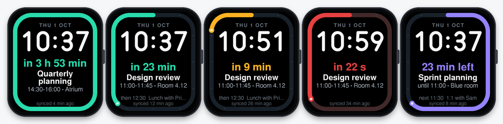
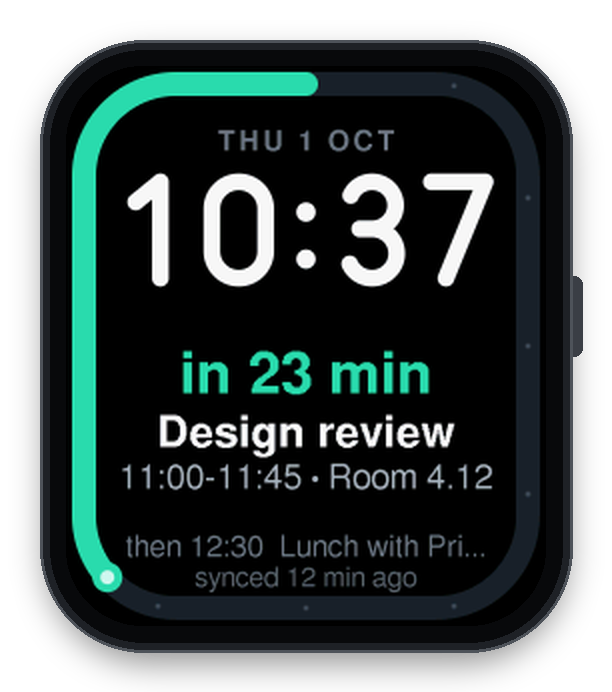
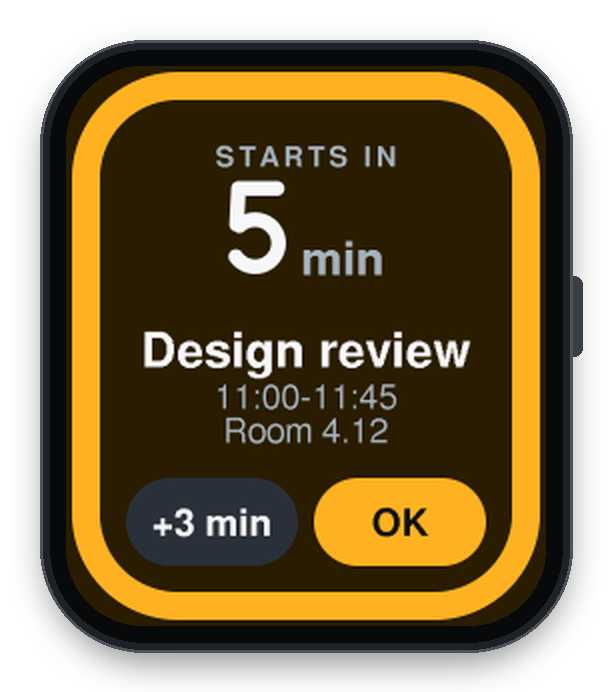
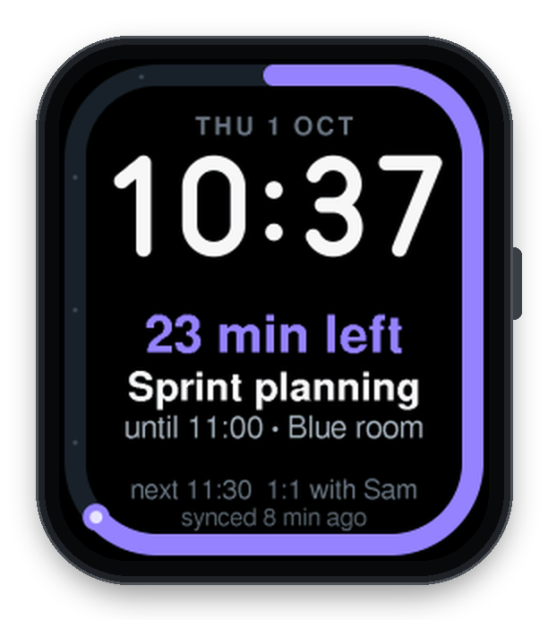
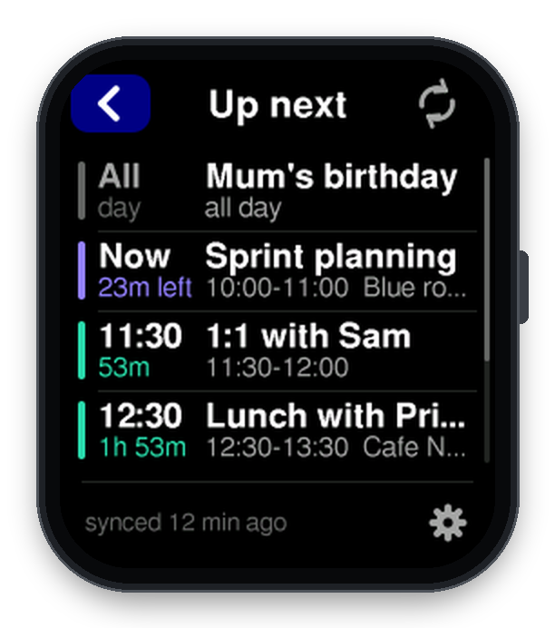

# Meeting Countdown

**A watch face for the EWatch: a ring drains toward your next meeting, and the
watch taps your wrist five minutes before it starts, even when it is asleep.**



Meeting Countdown is a complete EWatch firmware (BaseOS plus this face), built
from EWatch BaseOS @ `dbe73c2`. Installing it replaces whatever was on the
watch; your BaseOS settings (theme, WiFi networks, haptics) are kept.

| | |
|---|---|
|  |  |
|  |  |

## What it does

- **The face.** A bold ring hugs the edge of the screen. While your next event
  is more than an hour away the ring is full and calm mint; over the last
  60 minutes it drains clockwise from 12 o'clock to empty at the start time,
  shifting from mint through amber (about 15 minutes out) to red (the last
  five). The middle shows the time, large, the countdown ("in 23 min"), the
  event title, its start and end time and location, what comes after it, and
  how fresh the calendar is ("synced 12 min ago").
- **The final minute.** With under a minute to go the ring refills in red and
  sweeps away with the seconds, pulsing; each dot on the track is now five
  seconds.
- **During a meeting** the ring turns violet and fills with the meeting's
  progress; the text shows "18 min left", when it ends, and what's next.
  If a short meeting starts inside a long one (a 1:1 during an all-afternoon
  workshop), the face switches to counting down to it once it is within the hour.
- **All clear.** No events coming up: a calm, dim ring, "All clear", and any
  all-day event for today ("Today: Mum's birthday").
- **The alert.** Five minutes before an event the watch wakes from deep sleep,
  lights up and plays its own pattern (three quick knocks and a hum, repeated
  three times). Tap **+3 min** to snooze or **OK** (or press the button) to
  dismiss. It also alerts while you are using the watch.
- **Leave-now buffer.** Events can carry a "leave early" time (set on the web
  page or over USB; Apple calendars' travel time is picked up automatically).
  The ring then counts down to when you need to leave, says "leave in 8 min",
  and a separate "Time to leave" alert (two long pulses) fires.
- **Up next.** A list of the next events with countdowns, a Sync button and
  settings.

## Using it on the watch

| Where | Gesture | Does |
|---|---|---|
| Face | swipe up (or left) | app launcher (stock BaseOS) |
| Face | tap, or swipe down | **Up next** list |
| Up next | ⟳ (top right) | sync the calendar now |
| Up next | ⚙ (bottom right) | Meetings settings |
| Up next | swipe up / down | scroll |
| Alert | **+3 min** / **OK** | snooze / dismiss (button = OK) |
| Anywhere | button, or swipe right | back |
| Anywhere | hold the button 3 s | power off (alerts stop while off) |

The launcher's **Meetings** tile also opens Up next. **Settings** (from the
gear) cycles through values with a tap: alert time (off, at start, 1, 2, 5,
10, 15 or 30 min before), ring window (30 to 120 min), background sync
interval, and the watch face (Meeting or the classic BaseOS face; System →
Settings → Font still picks the classic face's style). **Test alert** shows
the alert screen with your next event. The footer shows the address of the
web page.

## Setting it up

1. **Get the watch on WiFi.** On the watch: System → Settings → WiFi → turn it
   on. In **Host** mode, join the WiFi network `EWATCH_SETUP` from your phone
   and open `http://192.168.4.1/`. Add your home WiFi under *Known networks*.
   (In **Client** mode the page is at the watch's address on your network,
   shown on the WiFi screen, or `http://ewatch.local/`.) The watch stays
   awake while the page is in use.
2. **Open Meeting Countdown** (the green link at the top, or `/meet`).
3. **Fix the clock first:** *Watch clock → Set watch time & zone from this
   phone.* Alerts are only as good as the watch clock, and this works even on
   the offline setup hotspot.
4. **Paste your calendar's private iCal address** into *Feed 1* and save:
   - Google Calendar: Settings → (your calendar) → *Integrate calendar* →
     *Secret address in iCal format*.
   - Outlook / Microsoft 365: Settings → Calendar → Shared calendars →
     *Publish a calendar* → ICS link.
   - iCloud: Calendar → share the calendar as a *Public Calendar* → copy the
     `webcal://` link.
   - Fastmail, Nextcloud, Proton and others: any `https://` or `webcal://`
     `.ics` link works.
   Up to three feeds are merged (work, personal, family). The full address is
   never shown again; the page shows `calendar.google.com/.../basic.ics`.
5. That's it. The watch syncs as soon as it goes to sleep (or press **Sync
   now** in Client mode), then every 30 minutes in the background.

### Other ways to add events (no internet needed)

- **The web page:** *Add an event* (title, date, start and end time, leave
  early, location), or *Import an .ics file* exported from any calendar app.
- **The USB cable:** `tools/push_events.py` speaks the serial protocol below.
  Run it with an interpreter that has pyserial, e.g.
  `~/.platformio/penv/bin/python tools/push_events.py ...`

  ```sh
  push_events.py --event "2026-10-01T09:30 +15m Standup"
  push_events.py --event "2026-10-01T14:00 +1h leave=20 loc=\"High St\" Dentist"
  push_events.py --clear --file today.txt        # one event spec per line
  push_events.py --ics ~/Downloads/calendar.ics  # parsed on the watch
  push_events.py --list --status
  push_events.py --feed 1 "https://.../basic.ics" --sync
  push_events.py --set offsets 10,5 --set lead 60 --test-alert
  ```

Events added on the web page (up to 8) and pushed over USB (up to 16) live
alongside the calendar feed; duplicates are merged.

## Design notes

### The ring

The ring drains over a **fixed lead window** (60 minutes by default,
configurable 30–120) rather than over "the time since the previous event".
A fixed window makes the ring a dial you can read: half a ring is half an
hour, every track dot is five minutes, and with a meeting on the hour the
ring's edge sits where the minute hand would be. A between-meetings window
would drain at a different speed every time, and for the first meeting of the
day (previous event: yesterday) it would hardly move.

The ring is a rounded rectangle that follows the screen edge, parametrised by
arc length so it drains at an even speed through the corners. It is drawn
anti-aliased (signed distance per pixel) with round caps, a bright "head" at
the leading edge, and 12 track dots. The colour blends in HSV from calm mint
(≥ 20 min) to amber (10–5 min) to red (≤ 2 min).

### Drawing

Everything is drawn by `lib/meetcore` into the 240×280 RGB565 frame canvas and
flushed once; the face redraws only when something visible changed (minute,
ring position, countdown text, status), about every 4 seconds. Text is the
FreeSans 24 pt bitmaps already in BaseOS, area-sampled down to the sizes
needed so it is smooth and anti-aliased. The big time uses an original rounded
monoline digit set drawn from line and arc strokes, crisp at any size. Because
the renderer is plain C++, `tools/preview/render.sh` draws every screen on a
computer with the same code; the images in `docs/` come from it.

### Calendar feeds (`lib/meetcore/src/ics_parser.*`)

Feeds can be megabytes (Google exports your whole history), so the parser is
a pure stream: bytes go through a one-character-lookahead line unfolder, a
property lexer that keeps only what it needs (giant DESCRIPTION lines pass
through without being stored), and a component state machine. Memory is fixed
(~17 KB, allocated in PSRAM). It handles:

- line folding with CRLF, LF or CR, space or tab continuation, folds that
  split a UTF-8 character, a UTF-8 BOM;
- `DTSTART`/`DTEND`/`DURATION` in UTC (`Z`), floating time, `TZID=...` and
  `VALUE=DATE`;
- **`VTIMEZONE` blocks**: the STANDARD/DAYLIGHT rules in the feed are
  evaluated, so a 9 am New York standup is 9 am New York time on both sides of
  either country's daylight-saving change. Unknown TZIDs and floating times use
  the watch's own offset;
- all-day events (kept, shown in Up next and the clear state, never alerted;
  Outlook's `X-MICROSOFT-CDO-ALLDAYEVENT` too);
- `RRULE` with `FREQ=DAILY/WEEKLY/MONTHLY/YEARLY`, `INTERVAL`, `COUNT`, `UNTIL`
  (UTC, local or date), `BYDAY` (with ordinals such as `-1FR` for monthly and
  yearly), `BYMONTHDAY`, `BYMONTH`, `BYSETPOS`, `WKST`; long `COUNT` series
  jump straight to the window arithmetically; `RDATE`; `EXDATE` (date-time and
  date forms);
- `RECURRENCE-ID` overrides: moved instances replace the original, cancelled
  ones remove it, in whatever order they appear in the file;
- `STATUS:CANCELLED`, `X-APPLE-TRAVEL-DURATION` (leave-now buffer),
  `X-WR-CALNAME`, `X-WR-TIMEZONE`; text unescaping; accents folded to ASCII for
  the watch fonts (é → e, ß → ss), emoji dropped.

It keeps events overlapping the next **48 hours**, at most **16** (of which at
most 4 all-day), sorted.

### Sync

A sync connects to the strongest saved WiFi network (or rejoins the last
access point directly, skipping the scan), sets the clock by SNTP (or from the
server's `Date` header), then fetches each feed over HTTPS and streams it
straight into the parser. Details that matter on this hardware:

- **TLS memory.** mbedTLS allocates from internal RAM (~45 KB per session).
  Each feed gets a fresh `WiFiClientSecure` that is destroyed right after; no
  session is ever parked (the lesson from EWatchOS's "TLS heap parking" fix).
  If internal heap is short, the sync reports "low memory" instead of failing
  half-way. Scratch buffers live in PSRAM.
- **Certificates are verified** against the Mozilla root bundle that the
  ESP-IDF SDK already contains (136 roots, 64 KB of flash), with host-name
  checks. Self-hosted calendars with private certificates can opt out on the
  web page.
- **Bounded.** DNS, connect + handshake and every read are each well under the
  20 s task watchdog; a stall of 12 s or a redirect loop fails the feed; a
  headless sync has a 60 s budget. Our own small HTTP/1.1 client handles
  Content-Length, chunked and close-delimited bodies and up to 4 redirects
  (`webcal://` becomes `https://`).
- **Failures are partial.** A feed that fails keeps its previously cached
  events; the face shows "offline - synced 3 h ago" (amber after 3 hours).
- **Time zone.** If the calendar names its zone (`X-WR-TIMEZONE`) the watch
  follows its daylight-saving changes automatically, but only DST-sized steps
  (≤ 1 hour). A bigger difference means the calendar lives in another zone
  than you, so the web page points it out and offers to set the clock from
  your phone instead.

### Alerts and sleep (`mc_app.cpp`, `mc_agenda.cpp`)

BaseOS deep-sleeps after 5 s and, with no timer armed, powers fully off 30 s
later. Meeting Countdown keeps one `apptimer` deadline armed whenever there is
something to wait for, and decides it **every time the watch goes to sleep**
from the persisted events, so the chain of alerts can never be stranded: a
missed re-arm, a deleted event, a changed setting or a clock correction are
all absorbed at the next sleep.

- **What it waits for:** the next alert (each enabled offset, the leave-now
  time, a snooze), the next background sync, or a 4-hour heartbeat.
- **Timer drift.** The ESP32-S3 sleep timer runs from a ~136 kHz RC
  oscillator. It is calibrated at every boot but still drifts a few percent
  when the temperature changes (wrist to nightstand), and 6% of two hours is
  seven minutes. So a long sleep before an alert ends early (6%, at least
  20 s) and re-plans from the accurate RV-3028; each hop shrinks the error
  until the last one, 45 s or less, is slept as-is. A pending sync never
  pushes that wake later. A host simulation of whole days of meetings and
  syncs puts every alert within 4 s of its time at up to ±6% drift; at 8%
  none is lost (the worst is about 4 minutes late). The cost is one or two
  extra dark wakes per alert, about half a second each.
- **Headless wakes.** A timer wake that is not an alert (a pre-wake, a sync, a
  heartbeat) is handled in `setup()` before any UI starts: the screen stays
  dark, the watch re-plans or syncs and goes straight back to sleep. Pressing
  the button or touching the screen during a background sync aborts it and
  boots the UI. An alert boots the UI, and the alert is the first frame.
- **Bookkeeping in RTC memory:** an alert watermark (alerts at or before it
  are handled, so nothing repeats), the snooze, sync requests. A crash guard
  in `RTC_NOINIT` memory pauses background sync after two crashes during a
  sync.
- An alert that comes due late (the watch was busy or just woke) is still
  delivered up to 5 minutes after the event starts, then skipped. An event
  added after its alert time alerts straight away if it hasn't started. After
  a full power-off, alerts that fell due while it was off are not replayed.

### Storage

Everything lives in the NVS namespace `mtgcount`: settings (`cfg`), up to
three feed URLs (`feed0..2`), the feed cache (`evF`), web events (`evM`), USB
events (`evP`) and sync status (`sync`). The base `ewatch` namespace keeps its
schema; the only base setting this addon ever changes is the time-zone offset
(DST following, or "set from phone"). Writes happen only on change.

### USB serial protocol (`mc_console.h`)

Newline-terminated text at any baud rate. Every command ends with one line
starting `OK` or `ERR`; firmware log lines can be ignored.

```
HELLO                          OK meeting-countdown 1.0.0 proto=1 tz=+60
TIME                           OK 2026-10-01T10:37:12+01:00
EVENT <start> <end|+dur> [leave=<min>] [loc=<x>|loc="<x y>"] <title>
                               OK id=1a2b3c4d
DEL <id> | LIST | CLEAR [ALL] | STATUS | HELP
ICS BEGIN ... raw .ics lines ... ICS END   (the watch sends ACK every 32 lines)
FEED [<n> <url>|<n> CLEAR]     SYNC          ALERT TEST
SET alerts|night|autotz|insecure on|off   SET lead|sync|snooze <min>
SET face meeting|classic                  SET offsets 10,5
```

Times are ISO 8601; without a zone they are the watch's local time. Two
date-only values make an all-day event. The serial port only exists while the
watch is awake; traffic keeps it awake for 90 s.

## Power strategy and battery estimate

What changes compared with stock BaseOS: with events or a feed configured, the
watch stays in **deep sleep** between uses instead of powering off after 30 s,
so it can wake for alerts and syncs. With nothing to wait for, the stock
power-off still applies. To make long deep sleeps cheap, `MC_SLEEP_TRIM` puts
the display into SLPIN, turns the backlight PWM off and puts the accelerometer
into standby (unless it is a wake source) before sleeping; stock BaseOS left
the MMA8451 sampling at 800 Hz (~165 µA).

Estimate per day (assumptions to verify on hardware: a 250 mAh cell, board
deep-sleep current 50–120 µA with the trim, ~50 mA screen-on, ~110 mA average
with WiFi active):

| Item | Assumption | mAh/day |
|---|---|---|
| Deep sleep | 50–120 µA × 24 h | 1.2–2.9 |
| Alerts | 8 meetings, ~10 s awake each (45 s worst) | 1.1 (5 worst) |
| Pre-wakes and heartbeats | ~25 wakes × 0.6 s × 35 mA | 0.15 |
| Background sync, every 30 min, paused 23:00–06:00 | 34 syncs × ~6 s × 110 mA (feed < 500 KB) | 6.2 |
| Same, a 3 MB feed | 34 × ~20 s × 110 mA | 21 |
| Same, away from WiFi | failures back off 1, 2, 4, 8×: ≤ 8 tries × 5 s | ≤ 1.2 |

So about **9 mAh a day (~4% of 250 mAh)** with a typical feed at the default
settings, on top of normal use (100 glances × 5 s is another ~7 mAh). Hourly
sync roughly halves the sync line; "off (manual)" removes it. Background sync
pauses below 12% battery; alerts continue.

## Limitations

- **Time zones.** The watch keeps one UTC offset (BaseOS has no DST rules).
  Events in feeds are placed correctly via their own VTIMEZONE data; floating
  times, unknown TZIDs and USB/web events use the watch's offset. The watch
  follows daylight saving automatically only when a feed names its zone.
  `VTIMEZONE` blocks that appear after the events using them are not used.
- **Recurrence.** `BYWEEKNO`, `BYYEARDAY`, `BYHOUR`/`BYMINUTE` and `FREQ=HOURLY`
  or finer are not expanded (only the first instance shows);
  `RANGE=THISANDFUTURE` overrides act on a single instance.
- **Capacity.** The feed cache keeps the next 48 hours and at most 16 events
  (4 all-day): a very busy calendar is cut at the 16th event. With a
  30-minute sync, changes made in your calendar reach the watch within
  30 minutes (an alert can fire for a meeting cancelled since the last sync).
- **Text.** Titles are folded to ASCII for the watch fonts; non-Latin scripts
  (CJK, Cyrillic, Arabic...) are dropped and such events show "(no title)".
- **Encoding.** Feeds must be served uncompressed (we ask for `identity`).
- **Security.** Feed addresses are secrets. They are entered over plain HTTP
  on your LAN or the setup hotspot, stored unencrypted in NVS, and never shown
  back in full. The settings page has no password (same as stock BaseOS).
- **Off is off.** Holding the button to power off stops alerts until the
  watch is switched on again.
- 24-hour clock only, like BaseOS.

## Build, test, package

```sh
~/.platformio/penv/bin/pio run -d addons/Meeting_Countdown            # firmware (env:ewatch)
~/.platformio/penv/bin/pio test -d addons/Meeting_Countdown -e native # 60 host tests
python3 tools/package_addon.py addons/Meeting_Countdown               # build + dist/
sh addons/Meeting_Countdown/tools/preview/render.sh                   # host-rendered screens
```

The host tests cover the ICS parser (fixtures in `test/fixtures`, each parsed
at several chunk sizes; mutation fuzzing), recurrence across DST, the HTTP
framing, next-event selection, the ring fraction, alert times (midnight,
back-to-back, simultaneous, snooze, lateness), wake and sync planning
(including a simulated day of sleeps and wakes at ±6% timer drift that checks
every alert lands within 4 s and no sync crowds an alert), and the renderer
(ring geometry, every screen, fuzzing with guard bands). They also pass under
`-fsanitize=address,undefined`.

To check how your own calendar parses before flashing:

```sh
c++ -std=c++17 -O2 -Ilib/meetcore/src tools/ics_dump.cpp lib/meetcore/src/*.cpp -o ics_dump
curl -s "$FEED_URL" | ./ics_dump --offset 60
```

Build flags in `platformio.ini`: `MC_HEADLESS_WAKE` (screen-off handling of
non-alert wakes), `MC_BACKGROUND_SYNC` (periodic sync while asleep),
`MC_TLS_VERIFY` (certificate checks), `MC_SLEEP_TRIM` (sleep-current trim).
Each can be set to 0 if hardware testing finds a problem.

## Hardware test checklist

1. **Boot.** The face appears with the right time; the backlight comes on only
   after the first frame. Swipe up opens the launcher; tap opens Up next.
2. **Clock.** On `/meet`, *Set watch time & zone from this phone*; the watch
   shows your phone's time.
3. **Alert while asleep.** Add a web event starting in 7 minutes and let the
   watch sleep. At T−5 it should wake, light up on the alert and play the
   knock-knock-knock-hum pattern. **+3 min** re-alerts 3 minutes later; **OK**
   and the button dismiss. Repeat with the watch awake.
4. **Drift.** Add an event 2 hours ahead and note how close to T−5 the buzz
   lands (the serial log shows each `MC: sleeping Ns (prewake)` hop). Try it
   once with the watch on a cold windowsill. If the timer turns out to drift
   more than 6%, raise `kDriftPct` in `lib/meetcore/src/mc_agenda.h`.
5. **Sleep current** with `MC_SLEEP_TRIM=1`: measure it, confirm the screen
   stays dark during sleep and the display, touch and accelerometer wake
   correctly afterwards (also with Wake on motion enabled).
6. **Feeds.** Google, Outlook and iCloud addresses sync (certificates verify);
   a recurring meeting and a moved instance show at the right times; "synced
   X min ago" updates.
7. **Background sync** with the watch asleep: the screen must stay dark; the
   next wake shows fresh data. Press the button during one: the UI should come
   up within a second or two.
8. **No WiFi in range:** sync fails quickly, the face says "offline", and
   retries back off.
9. **USB:** `push_events.py --list`, `--event`, `--ics`, `--sync` with the
   watch awake; the session keeps it awake.
10. **Classic face** from Meetings settings; the line under the date shows the
    next meeting.
11. **24 h battery** with a feed at the defaults, compared with the estimate.

## Files

```
lib/meetcore/src/          pure C++ (host-tested): ICS parser, time, agenda/planner,
                           HTTP framing, renderer (mc_gfx, mc_ui), protocol parsing
src/apps/meeting/          device side: mc_app (state, NVS, planning), mc_sync (WiFi/TLS),
                           mc_views (screens), mc_web (/meet), mc_console (USB), mc_haptic
src/main.cpp, src/core/    BaseOS with the hooks: headless wake, sleep planning, alert route,
                           radio lease, keep-awake, crash-guard fix
test/                      Unity tests + .ics fixtures       tools/  push_events.py, ics_dump,
docs/                      screenshots (host-rendered)              preview/ (host renderer)
```

## Licence

MIT, see `LICENSE` (upstream EWatch BaseOS by Ewan Wills). The FreeSans fonts
are the GNU FreeFont files already shipped with BaseOS. Everything else here,
including the digit design and the icon, is original to this addon.
