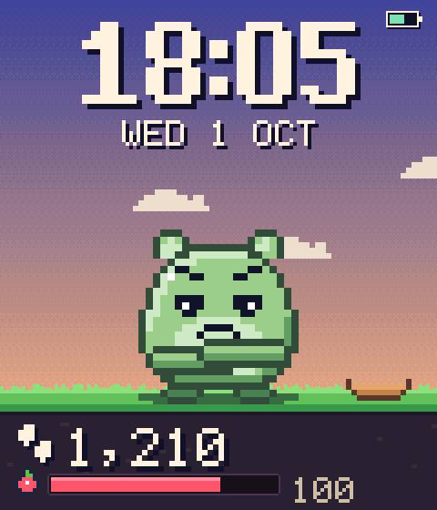
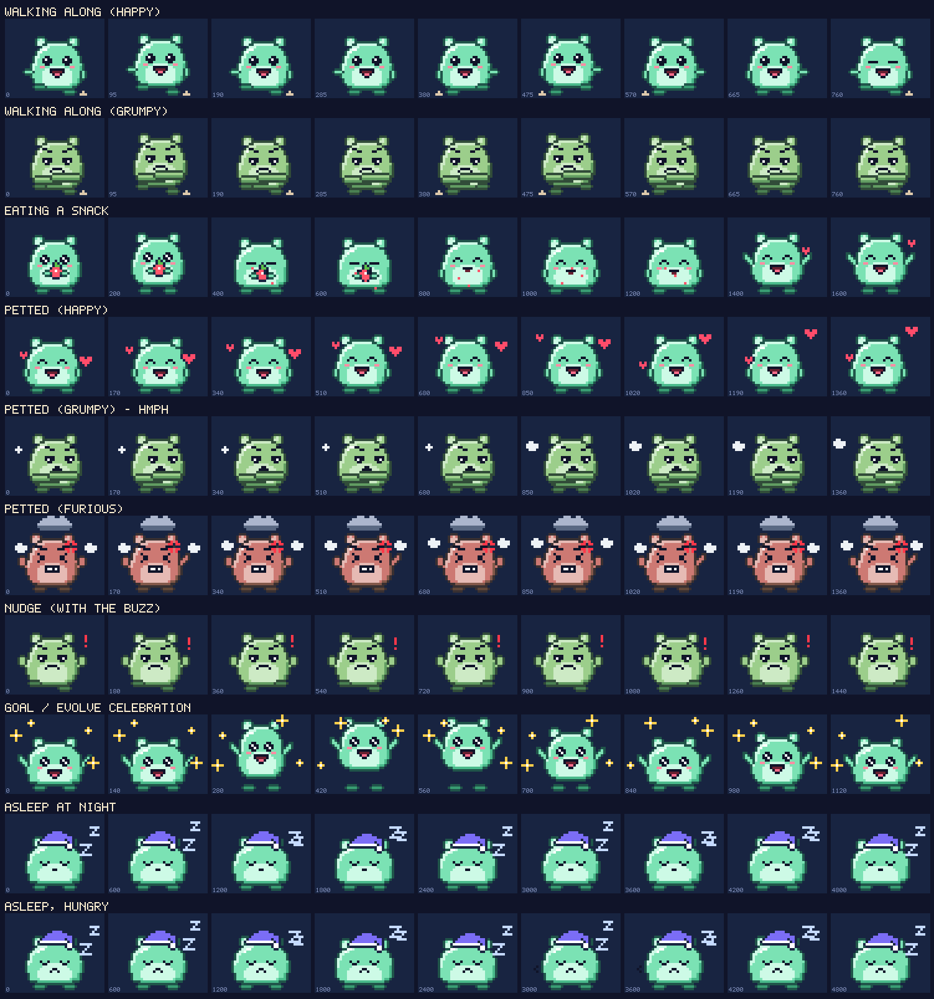
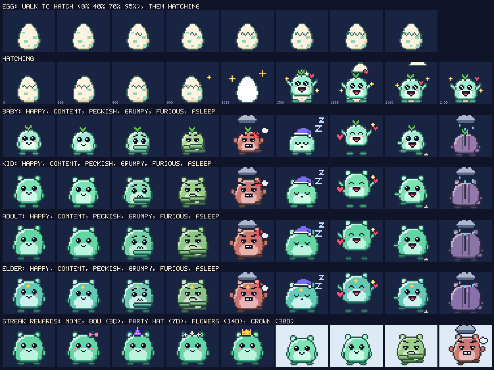
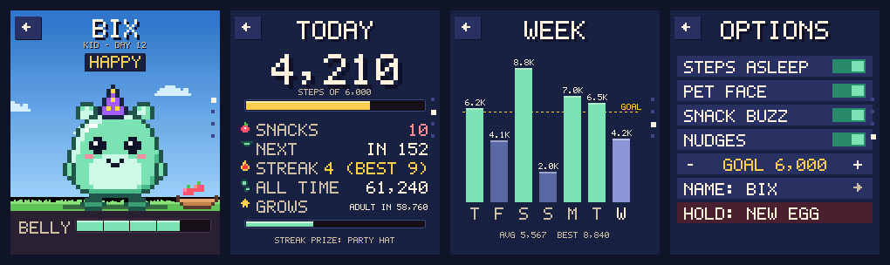

# Stepmunk — a pixel pet that only eats when you walk

*EWatch addon `pixel-pet` · game · built on EWatch BaseOS @ dbe73c2 · MIT*




Stepmunk lives on your watch face. Its only food is your footsteps: every
**400 steps** earns it a snack, which it eats on the spot (with a little
*nom-nom* buzz) or saves in its bowl for later. Skip your walks and it slides
from happy to peckish to grumpy (arms crossed, foot tapping, scowling) and
finally stomps under its own storm cloud before turning its back to sulk.
Go for a walk and you can watch it cheer up, snack by snack.

Steps keep counting with the screen off, so the pet is fed by your whole day,
not just the moments you look at it.

## What's on the watch

| Screen | What you see |
|---|---|
| **Watch face** (default) | Big clock and date over a sky that follows the time of day (dawn, day, sunset, dusk, starry night). The pet in its little world with its food bowl, today's steps (a gold star once the daily goal is met), and a bar showing progress to the next snack. While you walk, the pet marches along. |
| **Stepmunk app** (first tile in the launcher) | Four pages: the pet up close with its mood and belly meter; **Today** (steps vs goal, snacks, streak, lifetime steps, growth); **Week** (7-day chart with the goal line); **Options**. |
| **Settings → Face** | Pick the Stepmunk face or any stock BaseOS face style. |

### Gestures and buttons

| On the watch face | |
|---|---|
| Tap the pet | Pet it. It reacts to its mood: hearts when happy, "HMPH." with a turned head when grumpy, a shaken fist when furious. |
| Tap the bowl | Serve a snack from the bowl now (if it has room). |
| Tap the steps panel, or swipe down | Open the Stepmunk app. |
| Swipe up or left | Launcher (Stepmunk, System). |
| Button (or swipe right) | Screen off. Steps keep counting. |
| Hold the button 3 s | Power off (state is saved first). |

| In the Stepmunk app | |
|---|---|
| Swipe up / down | Next / previous page. |
| Tap the pet / bowl | Pet it / serve a snack. |
| Options | Tap toggles: **Steps asleep** (background counting), **Pet face**, **Snack buzz**, **Nudges**; **Goal** −/+ (2,000–20,000 in steps of 500); **Name** (cycles through 16 names); **Hold: new egg** (hold 2 s to start over). |
| Button, swipe right, or the ← chip | Back to the launcher. |

## The game

* **Snacks.** Every 400 steps = one snack worth 8.5 belly points. If the belly
  has room it eats at once; otherwise the snack goes into the bowl (holds 3),
  and the pet helps itself as soon as there's room. At bedtime it has a
  "bedtime feast" from the bowl and shares the rest, so a big walk carries it
  through the day but can't be banked for tomorrow.
* **Hunger** drains over real time, anchored to the RTC: 7 points/hour while
  awake, 1.5/hour asleep. It's replayed exactly after the watch has been asleep,
  so one catch-up after a long deep sleep gives the same result as constant
  updates (unit-tested to within 0.003 points).
* **Mood follows the belly:** happy ≥ 70 > content ≥ 50 > peckish ≥ 32 >
  grumpy ≥ 15 > furious. **Ecstatic** is a reward state (≥ 90 *and* fed in the
  last 45 min), so walking makes it light up. After 2 hours furious it
  **sulks**: back turned, its own rain cloud, a side-eye now and then.
* **Tuned for real days** (simulated in `test/test_pet`): 6–8k-step days keep it
  happy, with ecstatic moments after each walk. A lazy 1,500-step day leaves it
  grumpy by 19:00. Zero steps from a happy morning: grumpy after ~8 h, furious
  after ~11 h. The break-even is about 5,600 steps a day.
* **Night.** It sleeps 22:00–07:00 in a nightcap (frowning in its sleep if
  hungry). It never buzzes or nags at night. If you walk late, it wakes up to
  march along and munches its snacks quietly.
* **Haptics.** Snack *nom-nom-yum*, goal/evolve fanfare, hatch fanfare, and a
  low "grumble" nudge when it's grumpy or worse: at most 3 a day, at least 2 h
  apart, only 09:00–20:00, never within 30 min of a walk. Snack buzz and
  nudges can each be switched off.
* **Life.** It starts as an egg that hatches on your first 300 steps, then grows
  with lifetime steps: baby → kid (25k) → adult (120k) → elder (500k). It
  won't grow while grumpy, so feed it first.
* **Streaks.** Reach the daily goal (default 6,000) on consecutive days.
  Best-streak milestones unlock accessories it wears for good: bow (3 days),
  party hat (7), flower crown (14), crown (30).






## How it works

### Step detection (`src/core/steps.{h,cpp}`)
Pure C++, no Arduino, unit-tested on the host. The MMA8451Q samples at a fixed
**12.5 Hz** into its FIFO, so the detector sees evenly spaced samples whether
taskIO or the sleep loop drains them.

1. Magnitude `|a|` (orientation-free); an EMA (τ 1.2 s) removes gravity.
2. 2nd-order Butterworth low-pass at 3 Hz.
3. Peaks: local maxima above `max(floor, 0.55 × RMS)`, re-armed when the
   signal falls back below the baseline, refined with a 3-point parabola so
   intervals aren't quantised to the 80 ms sample period.
4. **Gate.** Intervals must be 0.25–2.0 s. A walk is confirmed only after
   5 consistent candidates (within ±25% of their mean, peak heights within 3×,
   and a confirmed rhythm of at least 60 steps/min). Then the whole chain is
   counted retroactively. Typing, gesturing, jolts, brushing teeth and most car
   bumps never form such a chain.
5. **Counting.** Every step whose interval is 0.55–1.6× the running period
   counts. A gap of up to 2.45× counts as two (one gentle step's peak was
   missed). Once walking, the peak floor drops from 0.075 g to 0.045 g, and
   stays low for 6 s after a walk ends, so steps that fade when the arm stops
   swinging keep counting.

Synthetic tests (`test/test_steps`, signals built in continuous time, rotated
by an arm-swing model, point-sampled without anti-aliasing, quantised and
clipped like the MMA8451):

| Scenario | Truth | Counted |
|---|---|---|
| Normal / slow / brisk walk | 200 / 120 / 200 | 199 / 119 / 199 |
| Run (clipping at 2 g) | 300 | 299 |
| Irregular walk (10% jitter) | 150 | 149 |
| Stop-and-go | 80 | 78 |
| Strong, then gentle arm swing | 200 | 199 |
| Same walk sampled at 50 Hz | 200 | 199 |
| 10 min desk + fidgets, 5 min typing, 10 min car ride, 2 min gesturing, brushing teeth, 25 jolts, 3-step shuffles | 0 | 0 |

The day book keeps today's count and lifetime total, plus a 30-day history.
It rolls over at local midnight from the RTC date. Steps counted before the
clock is set are credited to the first valid day, and setting the clock back
resumes that day rather than losing it.

### The pet (`src/apps/pet/petmodel.{h,cpp}`)
Pure C++, unit-tested over simulated days with the real step book. State is
a POD (versioned) persisted in the addon's own NVS namespace **`pixelpet`**,
and mirrored (with a checksum) in no-init RTC memory, which survives deep
sleep and also a crash reset, so neither loses a step or a snack. The shared `ewatch`
namespace is only read, never reinterpreted. The face choice is stored in
`pixelpet`, so the shared `wfStyle` key keeps its meaning for other firmwares.

### Art (`src/apps/pet/petart.cpp`, `scenes.cpp`, `px.cpp`)
All art is original. The pet is composed per frame into a 40×32 palette buffer
and blitted with nearest-neighbour scaling (×4 on the face, ×5 in the app).
The body is generated procedurally (gumdrop silhouette, coloured outline, cel
shading, belly, shine), so squash/stretch and the four growth stages come
free. Faces, limbs, accessories and effects are hand-authored ASCII stamps,
size-checked at compile time. Every frame is a pure function of (pose, time).
The scenes and a 5×7 / 6×9 pixel font are drawn by a tiny software renderer
into the PSRAM frame canvas. The face flushes only the bands that changed:
clock (1 Hz), pet (~9 fps) and stats.

## Power strategy

Stock BaseOS deep-sleeps after 5 s and powers off 30 s later, so nothing runs
in the background. Stepmunk replaces that (build flag `PIXELPET_BG_STEPS`,
runtime toggle **Steps asleep**):

1. **Screen off = light sleep, not deep sleep.** The backlight fades out, the
   ST7789 goes into SLPIN, and taskIO parks cooperatively at a safe point.
   The render task then loops on `esp_light_sleep_start()`. The MMA8451 FIFO
   (12.5 Hz, watermark 20) raises INT2 about every **1.6 s**. Each wake drains
   it over I2C (one 120-byte burst), runs the detector, updates the pet (which
   may buzz) and sleeps again. That's 5–10 ms awake per wake.
2. **Wake to screen.** The button, a touch, or (with Settings → Sleep → IMU) a
   wrist jolt takes the fast path back to the face. There's no reboot, so it
   repaints, sends DISPON and fades the backlight in. The press, tap or swipe
   that woke the watch is swallowed, so it doesn't also act as "back" or a
   tap. A button press while the screen is fading out, or while a dark
   (background) boot is still starting up, is latched and wakes the screen.
3. **Deep tier.** After **12 min** without movement (a spread of `|a|` under
   0.045 g and no steps), it checkpoints and deep-sleeps. Wakes are a
   sensitive (~0.19 g, high-passed) motion interrupt on INT1, the button,
   touch, and a timer for the next possible nudge (at most 6 h). Before
   sleeping it waits for INT1 to stay quiet for 0.6 s (the accelerometer's
   high-pass filter needs about a second to settle after reconfiguring); if
   INT1 keeps firing for 4 s the wrist is moving, so it keeps sampling
   instead. The motor enable and the backlight are held low through deep
   sleep. Motion and timer wakes **boot dark** and go straight back to the
   sampler, so a walk loses only its first few steps. A phantom touch from
   deep sleep re-sleeps without lighting up, until the wake it had planned
   and with the same motion wake; after 6 phantoms in one sleep, touch wake
   stays off until the next real wake.
4. **No idle power-off** in this mode. Instead there's a **low-battery
   cutoff**: three plausible readings below 3.40 V, at least a minute apart,
   save and power off. Readings outside 2.9–4.6 V are ignored, so a missing
   divider can't trigger it.

**Safeguards.**
* The button always wakes the watch, regardless of the Sleep settings.
* INT2 stuck high, or silent (timer wakes keep finding a full FIFO), falls back
  to 1.4 s timer polling.
* More than 20 phantom touch wakes in 10 s switches to button-only wake until
  the next wake.
* The sleep loop never sleeps while the haptic motor is running.
* Going dark reprograms the accelerometer; with raise-to-wake on, its jolt
  filter is allowed to settle first, so switching off never reads as a jolt
  that lights the screen straight back up.
* A press or tap while the deep tier is being armed wakes the screen as usual
  (phantom touches are filtered there too).
* The low-battery count survives deep sleep, so a still watch that only
  wakes now and then still reaches the cutoff.
* With a USB host attached, sleep is simulated so serial keeps working.
* **Crash safe mode:** two crashes in a row while dark (brownouts don't
  count) turn background stepping off until the next power cycle. The watch
  carries on with stock sleep instead of crash-looping into BaseOS's 3-strike
  power-off, and Options shows "STEPS ASLEEP N/A". The record lives in
  no-init RTC memory with a check word, because ordinary RTC variables are
  re-initialised by the bootloader on every reset except a deep-sleep wake.
  After two crash-boots in a row the RTC copies of the pet and steps are
  ignored in favour of the last flash checkpoint.
* BaseOS's watchdog and 3-crash power-off guard stay in place (the guard
  now actually trips: see below).

### Fixes to BaseOS carried in this fork

Found while building the background sampler; all small, all worth upstreaming.

* The panic-loop counter was `RTC_DATA_ATTR`, which the bootloader resets on
  every panic or watchdog reset, so the 3-strike guard could never trip. It's
  now `RTC_NOINIT_ATTR` with a check word.
* At boot the LDO latch is driven high *before* its pad hold is released
  (BaseOS released it first on a deep-sleep wake, leaving the LDO enable
  floating for a moment). ext1 wake pins are also released from any RTC hold.
* `enterDeepSleep()` parks taskIO at a safe point instead of suspending it
  mid-I2C-transfer (which could leave the Wire lock held), and always keeps a
  way to wake up: if auto power-off is disabled, or neither touch nor the
  accelerometer can wake the watch, the button does, whatever the settings
  say. It also holds the motor enable and backlight low while asleep.
* Rejected touch wakes back off: after 6 in a row, touch wake is left off
  until the next accepted wake (a touch line stuck low used to reboot-loop
  forever).
* Power off (and auto power-off) waits for SW2 to be released. If the chip
  is still running 3 s later (USB keeps the rail up), it deep-sleeps with
  only SW2 as a wake source and the latch held low: it looks off, SW2 brings
  it back, and unplugging really powers it off. BaseOS idled into the
  20-second task watchdog instead (a crash reboot and the crash screen), or
  spun forever in the auto-off case.
* The countdown alarm's buzz intensity was 400 in a `uint8_t` (wrapping to
  144); it's 255.

### Battery estimate (unmeasured; please measure)

| Consumer | Estimate | Basis |
|---|---|---|
| Screen on (6-s glances) | 60–80 mA | backlight ~78% PWM, CPU 240 MHz, panel, touch |
| Light sleep (ESP32-S3 + PSRAM) | 0.3–0.6 mA | datasheet ~0.24 mA plus PSRAM retention |
| Sampling wakes | ~0.15 mA | 0.63 wakes/s × ~8 ms × ~30 mA |
| MMA8451 at 12.5 Hz, ST7789 in SLPIN | ~0.04 mA | datasheets |
| Deep tier (ESP32-S3) | ~0.02 mA | |
| **CST816S scanning, if touch-wake is on** | **1–3 mA (unknown)** | kept scanning so a tap can wake (EWatchOS2.1 found its auto-sleep stops touch wake) |

A typical day (16 h worn, 8 h still overnight, 60 glances):

* **Touch-wake on (stock default):** ≈ 7 + 16 × 2.8 + 8 × 2.1 ≈ **65–70 mAh/day**.
* **Settings → Sleep → Touch off (button wakes):** ≈ 7 + 16 × 0.8 + 8 × 0.1
  ≈ **20 mAh/day**.

On a 250 mAh cell that's roughly 3–4 days versus about 12 days. The touch
controller's scanning current dominates and is the first thing to measure.
With **Steps asleep** off you get stock BaseOS behaviour, at the cost of
counting only while the screen is on.

## Build flags (`platformio.ini`)

| Flag | Default | Effect |
|---|---|---|
| `PIXELPET_BG_STEPS` | 1 | 0 = stock deep sleep + auto power-off; steps count only while the screen is on. |
| `PIXELPET_DEEP_TIER` | 1 | 0 = never leave light sleep (simpler, slightly more drain). |
| `PIXELPET_STILL_MIN` | 12 | Minutes of stillness before the deep tier. |
| `PIXELPET_PANEL_SLPIN` | 1 | 0 = DISPOFF only while dark (faster wake, more current). |
| `PIXELPET_LOWBAT_CUTOFF` | 1 | 0 = no low-battery power-off. |
| `PIXELPET_CONSOLE` | 1 | Serial console in `loop()`. |
| `EWATCH_ENABLE_WIFI` | 0 | WiFi compiled out (see limitations). |

## Limitations

* **Unverified on hardware.** Everything was compiled, unit-tested and
  host-rendered, but nothing has run on a watch yet. The light-sleep and
  deep-tier paths follow EWatchOS2.1's proven mechanics, but the FIFO
  watermark wake, SLPIN/SLPOUT timing and the current figures need the
  checklist below.
* **Wrist step counting** misses steps when the arm doesn't move (hands in
  pockets, pushing a buggy or trolley) and can count regular arm motions at
  walking pace. Detector thresholds come from synthetic data. Record real walks
  with the console (`rec`, `dump`) to tune them.
* The first ~3–4 steps of a walk are counted only once it's confirmed (by
  design), and a walk starting from the deep tier loses the steps taken
  during the ~1 s boot.
* Lifting the wrist after a long still spell boots the watch dark for about
  a second. A button press during that second is latched and lights the
  screen; a tap in that window can be missed (tap again).
* **WiFi is compiled out** (no NTP time sync or web settings). A live radio
  can't coexist with the light-sleep sampler. Set the clock in Settings. The
  RV-3028 drifts only seconds per month.
* The night window is fixed at 22:00–07:00, and the clock has no DST rules (as
  in BaseOS).
* USB-CDC stops in real light sleep. Plug in before the screen goes dark, or
  wake the watch, to use the console.
* Settings → Sleep → "Sleep -> off" is unused while steps count in the
  background (the label says so).

## Build, test, preview, package

```sh
~/.platformio/penv/bin/pio run -d addons/Pixel_Pet              # firmware (env:ewatch)
~/.platformio/penv/bin/pio test -d addons/Pixel_Pet -e native   # 46 host tests
addons/Pixel_Pet/tools/preview/build.sh                         # re-render docs/*.png
python3 tools/package_addon.py addons/Pixel_Pet                 # build + package into dist/
```

The tests cover the step detector and day book (`test_steps`), the pet over
simulated days (`test_pet`), and render safety (`test_render`). The last one
draws every stage, mood, act and accessory at many time offsets, plus the
face and app with extreme values, into a buffer ringed with canaries, so any
out-of-bounds write fails.

`tools/preview/build.sh [out_dir] [filter]` compiles the watch's own drawing
code with clang++ (output paths are relative to the addon folder; the default
is `docs`) and writes PNGs (filters: `moods acts life close faces app`).
`build.sh . icon` regenerates `icon.svg` from the real sprite, and
`build.sh docs story && python3 tools/preview/story.py docs docs/story.gif`
rebuilds the animated GIF.

## Serial console (115200, optional)

`status`, `pet`, `hist`, `steps <n>` (pretend you walked), `full <0-100>`
(set the belly to test moods), `rec <seconds>` / `rec stop` / `dump` (record
raw accelerometer samples in PSRAM and print CSV with the detector's count,
for tuning on real walks), `buzz`, `off`.

## Hardware test checklist (for Kyle and Ewan)

1. **First boot.** The egg face appears, and Sensor Test shows a sane battery
   voltage (the cutoff relies on it) and accelerometer values. `status` over
   serial: `background=on`.
2. **Counting, screen on.** Walk 200 counted steps looking at the watch. Expect
   195–205 (the count jumps by 5 at the start; that's the gate).
3. **Counting, screen dark.** Same walk without looking. Expect ±5–10%. You
   should feel a *nom-nom* buzz every 400 steps (daytime).
4. **Wake from dark.** Button, tap and swipe-right 20× each: the face appears
   in < ~200 ms with no garbage or flicker (SLPIN/SLPOUT), stays on, and the
   waking tap doesn't pet the pet. Repeat while charging to check phantom
   wakes. With Settings → Sleep → IMU on, the screen must not come back on
   by itself after going dark.
5. **FIFO wake.** `status` while dark (on USB, simulated): `wakes fifo` grows
   ~0.6/s and `int2 faults 0`. On battery, compare step counts before and after.
6. **Deep tier.** Leave it still for 15 min, then pick it up and walk. Steps
   should resume. `status` shows `deep entries` / `background boots` > 0.
   Then, after another 15 min still, raise the wrist and press the button
   within a second: the face must appear on that first press. After a night
   on battery, plug in and run `status`: `deep sleeps without motion wake`
   should be 0 and `deep entries put off` small (otherwise INT1 isn't
   settling: see `accel::configMotionWake()`).
7. **Current.** Dark light-sleep current with touch-wake on and off, and in
   the deep tier. This decides the battery-life claim (README table).
8. **3-second hold** powers off from screen-on and from dark. After power-on,
   steps, pet and history are intact. With USB plugged in it should stay dark
   (not reboot) until the button is pressed.
9. **Midnight.** Steps reset, history shows yesterday, and the streak updates
   when the goal was met.
10. **Night.** No buzzes 22:00–07:00. The pet sleeps in its nightcap.
11. **False steps.** Typing for 10 min, a car or bus ride, washing up. Report
    the counts (and a `rec`/`dump` capture if they're high).
12. **Nudge.** `full 20` around midday, sit still for 30 min: one grumble buzz,
    then none for 2 h.
13. **Low battery.** If practical, run it down and confirm the cutoff around
    3.40 V doesn't trigger early.

## Files

See `CLAUDE.md` for the architecture and extension points. New in this addon:
`src/core/{steps,steps_service,accel,bgpower,addonstore,console}.*`,
`src/apps/pet/*`, `test/test_{steps,pet,render}`, `tools/preview/*`, `docs/*`.
Modified BaseOS files: `main.cpp`, `core/controller.*`, `core/view.h`,
`core/model.h`, `drivers/{display,haptic,touch}.*`, `apps/system/view.cpp`.

## Licence

MIT. BaseOS © Ewan Wills (see `LICENSE`). Stepmunk's code, art, names and text
are original.
