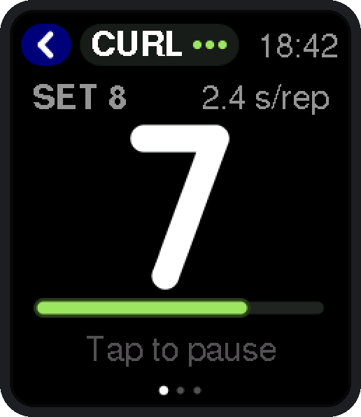
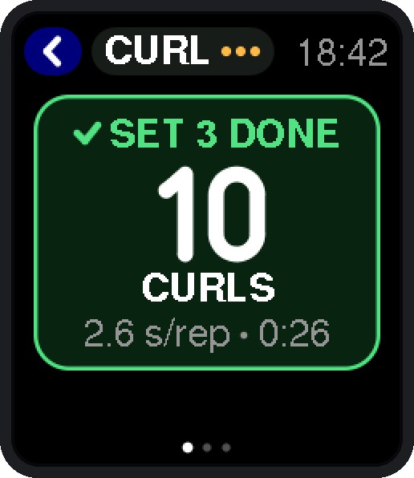
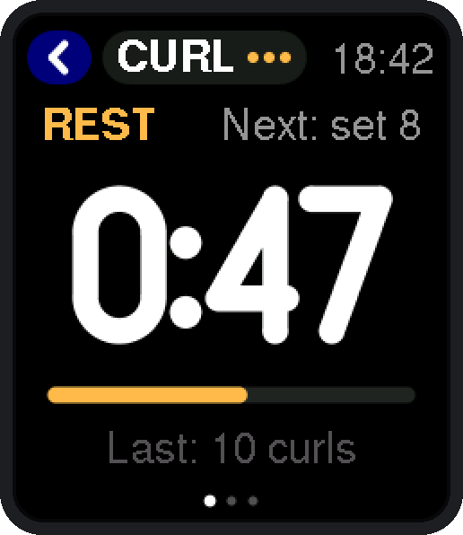
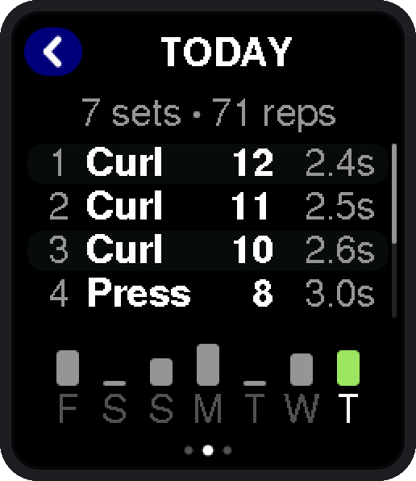
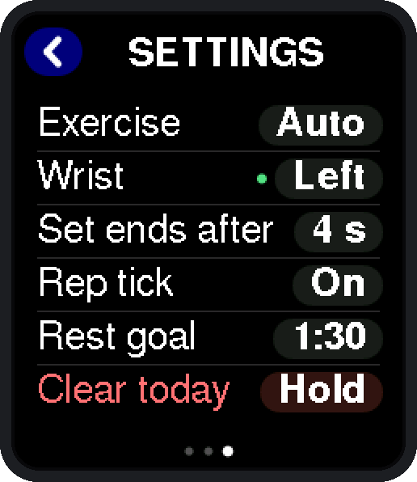
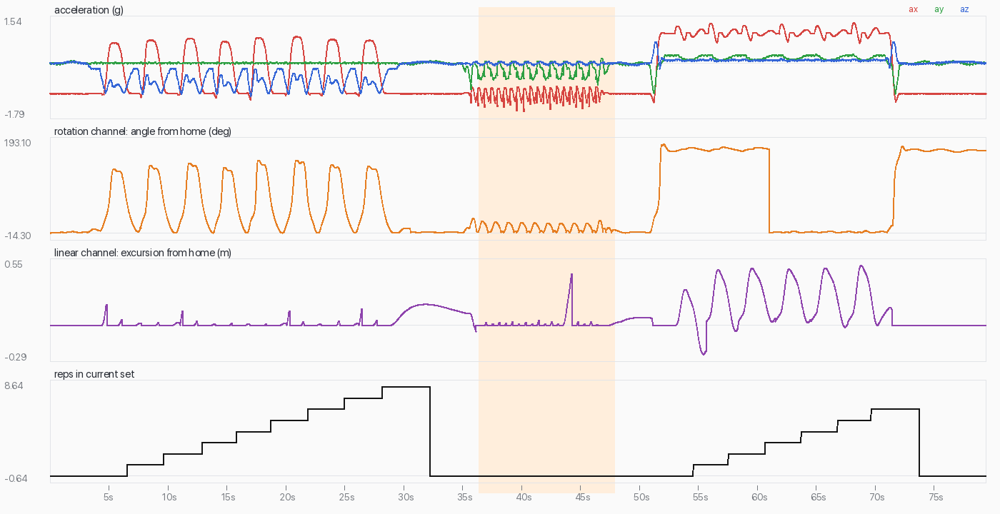

# Rep Counter for EWatch

Counts your reps from your wrist. Start a workout, pick up the weights and
lift: Rep Counter recognises curls, presses, raises and rows from how your
forearm moves, shows the count big enough to read mid-set, buzzes a distinct
pattern when you finish a set, and times your rest.

A complete EWatch firmware: BaseOS (watch face, launcher, settings, sleep,
WiFi time sync) plus the Rep Counter app. Addon id `rep-counter`, type `app`,
built on EWatch BaseOS @ `dbe73c2`.

| Lifting | Set done | Resting | Today | Settings |
|---|---|---|---|---|
|  |  |  |  |  |

## Using it

Swipe left on the watch face for the launcher; **Rep Counter** is the first
tile.

1. **Tap the big start button.** The screen now stays on and the watch is
   listening. (If you forget, a confirmed set starts the workout anyway, as
   long as the watch hasn't gone to sleep.)
2. **Lift.** The first rep shows in grey: it's provisional until a second,
   similar rep follows, which is how one-off movements like picking up a
   dumbbell get ignored. From the second rep on you get a light tick per rep
   (two ticks when the set is confirmed) and the number in white. The bar
   under the number follows each rep up and down; the chip at the top says what
   the watch thinks you're doing, with up to three dots of confidence.
3. **Stop.** About 4 s after your last rep (longer for very slow sets) the
   watch plays the set-done pattern (long, short, long), shows the reps and
   your tempo, and starts the rest timer. When your rest goal is up it buzzes
   twice and turns green; if the rest drags on past twice the goal (3 min
   minimum) you get a softer triple nudge.
4. **Next set**: just start lifting again. The rest timer stops by itself.

Controls:

| On the watch | Does |
|---|---|
| Tap the middle of the screen | Start, pause, resume |
| Tap the exercise chip | Auto → Curl → Press → Raise → Row → Auto |
| Swipe left (or tap the dots) | Main → Today's sets → Settings |
| Swipe up / down on Today | Scroll the list |
| Button or swipe right | Back. On the main screen while a workout is running it asks you to press again within 2.5 s, so a wrist pressed against the button mid-curl can't end your workout |
| Tap the screen while it's dimmed | Wakes it (doesn't start or pause anything) |
| Hold the button 3 s | Power off (BaseOS) |

Settings (saved on the watch):

| Setting | Choices | Notes |
|---|---|---|
| Exercise | Auto, Curl, Press, Raise, Row | Auto classifies each set. Picking one pins the label and the way reps are counted |
| Wrist | Left, Right | Only used to tell presses from rows until the watch has learned which way your hand points (a green dot appears) from your first curl or raise set |
| Set ends after | 3, 4, 5, 6, 8 s | Pause that ends a set. Slow sets automatically get longer |
| Rep tick | On, Off | The set-done pattern always plays |
| Rest goal | Off, 1:00, 1:30, 2:00, 3:00, 4:00 | Buzz when reached |
| Clear today | hold 1.5 s | Wipes today's log |

What counts as what:

- **Curl**: anything that swings the forearm about the elbow from hanging to
  well past level: curls of every grip, hammer curls, preacher and
  concentration curls, overhead triceps extensions, kickbacks.
- **Raise**: straight-arm lateral and front raises (arm from your side to
  about level, back of the wrist ending up).
- **Press**: the hand travels up and down along a roughly upright forearm:
  overhead press, dumbbell bench press (it copes with starting from lockout).
- **Row**: the hand travels with the forearm hanging: bent-over dumbbell rows.

Wear the watch snug, on the arm that's lifting. With alternating curls only
that arm's reps are counted.

Today's log keeps up to 40 sets (exercise, reps, start time, duration, rest,
tempo) plus a week of daily totals for the bar strip on the Today page. A new
day starts the first time you open the app after midnight (by the watch's
clock).

## How it works

Everything runs on the watch; nothing needs a phone.

**Sampling.** While the app is open, `taskIO` (the only task on the I2C bus)
switches the MMA8451 to 100 Hz high-resolution mode with its 32-sample FIFO
in circular mode and ±4 g range, drains it every cycle (2-3 samples), and
pushes the samples into a lock-free ring (`src/core/imu_stream.*`). Sample
timing comes from the chip's clock, so the detector gets an even 100 Hz no
matter how `taskIO` jitters. The newest sample is rescaled to BaseOS's usual
4096 counts/g for `model.ax/ay/az`, so the shake heuristic (`ImuMotion`) and
the diagnostics screens behave exactly as before. Jolt-wake is unaffected:
`TRANSIENT_THS` is independent of the range, and the chip is put back into
BaseOS's own configuration (±2 g, 800 Hz, FIFO off) when the app closes, at
boot, and before every deep sleep.

**Two counting channels**, run side by side (`src/apps/reps/rep_detector.*`):

- *Rotation*: low-pass the acceleration (4 Hz, then 1.5 Hz for the
  direction) to get the gravity direction in the watch frame, and measure its
  angle from a "home" direction captured where each rep starts. A curl swings
  that angle through 100-150°, a raise through 70-100°.
- *Linear*: |acceleration| minus its baseline is the vertical acceleration,
  whatever the watch's orientation. It's integrated to a velocity that is
  then high-passed (so a few mg of offset can't turn into drift) and again to
  a displacement in metres. A press or row moves the hand 25-50 cm while the
  forearm hardly turns. The channel freezes while the arm is turning fast
  (cleaning the weights up, curling) and re-learns its baseline once the arm
  is held still.

Each channel turns its signal into humps: leave home, reach a peak, come back.
**A rep is counted as soon as 60 % of the swing has been undone**, so the tick
arrives on the way down. The turnaround at the bottom becomes the next rep's
home, so drift and changes of posture between reps don't accumulate.

**Is it a rep?** Candidates must take 0.4-8 s (start to counted point) and be
big enough (50° / 15 cm), and must look like a lift:

- a curl or raise changes how steeply the forearm points (gravity along the
  watch's X axis): swinging arms while walking, waving and turning your wrist
  don't;
- raises start from a hanging arm and take at least a second;
- the path has to be smooth (distance travelled close to twice the swing);
- before a set is confirmed, a hump that sits parked at the top (a sip of
  water, a look at the watch) doesn't count;
- a row pulls up first (bending down to pick something up goes down first);
- walking and running are recognised by a regular train of footfall spikes in
  |a| above 8 Hz (or sustained energy there), and nothing counts while that
  gate is up.

**Sets.** The first rep is tentative. A second rep on the same channel, in the
same direction, of similar size (0.55-1.8x) and duration, starting within 4 s,
confirms the set. A first rep that only just missed a threshold right before a
confirmed set is counted retroactively (the first rep after cleaning the
weights up is often under-measured while the filters settle). Later reps must
be 0.4-2.5x the set's median swing. The set ends after the configured pause
with nothing in flight (or 1.2x the set's own rep period for slow sets).

**Which exercise.** The channel says curl/raise vs press/row. Raise vs curl:
smaller swing ending with the back of the wrist facing up. Press vs row: is
the hand above or below the elbow? That needs to know which way the watch's X
axis points to the hand, which depends on the wrist and the mounting, so the
detector learns it: curls and raises start with the hand hanging, so after a
confirmed curl or raise set it knows. Until then it uses the Wrist setting.
The label never changes the count, only the channel does.



### Accuracy (synthetic)

There is no watch on the bench this was built on, so the detector was
developed against a physically-based simulator (`test/support/rep_synth.h`):
forearm kinematics for each exercise, differentiated to acceleration, plus
gravity, sensor offset (±40 mg), scale error (±2.5 %), noise, tremor, strap
wobble, oversampling and 14-bit quantisation. Every category below is 60
scenarios with randomised tempo, range of motion, grip, pauses, sticking
points, fatigue and wrist (`build/host/rep_bench --n 60`):

| Scenario | Sets | Exact | Within 1 | Label |
|---|---|---|---|---|
| Curls (0.8-1.5 s up, 1-2.4 s down) | 60 | 100 % | 100 % | 95 % |
| Hammer curls | 60 | 100 % | 100 % | 100 % |
| Slow curls (up to ~10 s per rep, pauses) | 60 | 97 % | 98 % | 95 % |
| Explosive curls (~1.4 s per rep) | 60 | 88 % | 97 % | 98 % |
| Overhead press (with clean up/down) | 60 | 100 % | 100 % | 100 % |
| Slow presses with sticking points | 60 | 100 % | 100 % | 100 % |
| Bench press from lockout | 60 | 100 % | 100 % | 100 % |
| Lateral and front raises | 60 | 100 % | 100 % | 100 % |
| Bent-over rows | 60 | 97 % | 100 % | 100 % |
| Workouts: 3 mixed sets + rests + walking | 180 | 100 % | 100 % | 99 % |

False sets: none in 90 min of walking or 67 min of running; one in 2 hours of
continuous random wrist motion; one across 60 runs of everyday gestures
(checking the watch, drinking, picking things up). Labels: the misses are
reverse-grip curls with a short range, which look like raises.

Real arms are messier than any simulator. Treat these numbers as "the logic
works", and use the recording workflow below to tune on real sets.

## Recording sets for tuning

The firmware has a serial console on the USB cable (115200 baud):

| Command | |
|---|---|
| `REC on` | Stream raw accelerometer CSV (100 Hz, raw counts, ±4 g) with the watch's own rep events as `# ev` lines. Keeps the screen on |
| `REC off` | Stop (also stops by itself 10 s after the USB host goes away) |
| `status` | One line: phase, reps, set, mode, today's totals |
| `log` | Today's sets as CSV |

`tools/record.py` does the bookkeeping (pyserial; PlatformIO's Python has it):

```sh
~/.platformio/penv/bin/python tools/record.py --label "db curl 10kg" --expect 12,10 --exercise Curl,Curl
# lift, Ctrl-C when done -> recordings/rec_<time>.csv
```

It opens the port with DTR/RTS held low so the watch doesn't reset, writes
your expectations into the header (`# expect reps=12,10 exercise=Curl,Curl
tol=1`; use `--expect ""` for "no sets", e.g. a walk), and shows live progress.

Replay through the same detector code, built for the host:

```sh
tools/host/build.sh                                  # needs only clang++
build/host/rep_replay recordings/rec_x.csv --events  # sets, events, PASS/FAIL vs expect
build/host/rep_replay recordings/rec_x.csv --cands   # every candidate rep with its features
build/host/rep_replay recordings/rec_x.csv --trace /tmp/t.csv && python3 tools/plot_trace.py /tmp/t.csv /tmp/t.png
build/host/rep_replay --list                         # all tuning values
build/host/rep_replay recordings/*.csv --set returnFrac=0.55 --set rotMinRepDeg=45
```

To make a recording a regression test, give it the right `# expect` line and
copy it into `test/data/`; `pio test -e native` replays everything there. The
files there now are synthetic (`build/host/rep_synth_csv <category> <seed>
out.csv` makes more). After changing a tuning value, run
`build/host/rep_bench --n 40` (and `--poll`) to see the effect on every
synthetic category, then the replay tests.

## Power

Outside the app nothing changes: no background work, BaseOS sleeps as usual.

Inside the app, while a workout is running (ready, lifting or resting) the
screen stays on (`blockSleep`). To keep that affordable:

- after 20 s without a touch during a rest (or before the first set) the
  backlight dims to a quarter; a rep, the set-done card, a rest buzz or a
  touch brings it back;
- the screen is redrawn only when something visible changes, and only the
  rows that changed are sent to the panel;
- after 10 minutes without a rep or a touch the workout pauses itself, which
  lets the watch sleep normally (5 s by default). Today's log is already
  saved, so nothing is lost;
- when paused or before starting, the normal sleep timeout applies.

The accelerometer in 100 Hz high-resolution mode draws about 0.17 mA,
negligible next to the screen and CPU.

Estimate (not measured; the board's currents and battery capacity aren't
documented in the repo): ESP32-S3 at 240 MHz mostly idle ~35-40 mA, panel and
backlight at the default brightness ~15-20 mA, dimmed ~5 mA. A one-hour
workout with 15 minutes of lifting and 45 minutes of (mostly dimmed) rest
averages about **45-55 mA, roughly 50 mAh per hour**, so about a fifth of a
250 mAh battery per hour at the gym.

## Build, test, package

From the repository root:

```sh
~/.platformio/penv/bin/pio run -d addons/Rep_Counter                 # firmware (env:ewatch)
~/.platformio/penv/bin/pio test -d addons/Rep_Counter -e native      # 48 host tests
python3 tools/package_addon.py addons/Rep_Counter                    # build + dist/
```

From `addons/Rep_Counter/` (host tools need only clang++ and Python with Pillow):

```sh
tools/host/build.sh                                  # -> build/host/{rep_bench,rep_replay,rep_synth_csv,rep_preview}
build/host/rep_bench --n 40                          # accuracy on every synthetic category
build/host/rep_preview build/previews && python3 tools/previews.py build/previews docs
```

Build flags in `platformio.ini`:

| Flag | Default | |
|---|---|---|
| `REPS_IMU_FIFO` | 1 | 0 = never reconfigure the accelerometer; resample `taskIO`'s ~45 Hz polls to 50 Hz instead. The fallback if the FIFO path misbehaves on hardware (accuracy in the tests is close, but walking/running are rejected a little less reliably and fast curls can clip at ±2 g) |
| `REPS_RANGE_4G` | 1 | ±4 g in FIFO mode (0 = ±2 g) |
| `REPS_ENABLE_REC` | 1 | The serial console |
| `EWATCH_ENABLE_WIFI` | 1 | BaseOS WiFi (time sync, web settings); unused by the app |

The numeral font is generated: `python3 tools/gen_font.py` rewrites
`src/apps/reps/rep_font.h` (original monoline design, 4-bit anti-aliased).

## Limitations

- **Tuned on simulated data only.** Thresholds will need checking against
  real recordings (see above). The likeliest real-world surprises: strap
  slop, very heavy slow reps, partial reps, and people who rest with their
  arms in unusual positions.
- Counts the arm wearing the watch only.
- Exercises outside the four families (squats, deadlifts, push-ups, cable
  machines with the hand fixed) aren't counted, by design.
- Very fast "pump" curls (under ~1.3 s per rep) are sometimes undercounted:
  the arm's own acceleration swamps gravity.
- A paused rep (a long squeeze at the top) as one of the first two reps of a
  set can be taken for "not a lift" in Auto mode; once the set is confirmed,
  pauses are fine. Pick the exercise manually for paused sets.
- The press/row label depends on knowing which way the hand points; before
  the first curl or raise set it relies on the Wrist setting and an
  unverified mounting constant (see the checklist).
- The rest timer and workout state live in RAM: they don't survive the watch
  going to sleep. Logged sets do.
- Day rollover uses the watch's clock. If the clock isn't set (year before
  2024), everything stays in one log.

## Hardware test checklist

1. **Axes.** In BaseOS → System → Sensor Test, face up on a table: Z ≈ +4096.
   Hold the watch on the left wrist with the arm hanging: X should read about
   −4096 (the default assumes +X points to the fingers on the left wrist). If
   it reads +4096, flip `handAxisSignLeft` in `rep_detector.h` (only affects
   press vs row before the hand direction has been learned).
2. **FIFO mode.** Open Rep Counter with USB connected and send `status`:
   "imu stream on". Send `REC on` for 10 s: about 1000 data lines, no `# gap`
   lines while the watch is still. Leave the app: Sensor Test values should
   look as before (same scale, updating smoothly).
3. **Jolt-wake still works** after using the app (enable "Wake on IMU" in
   Settings → Sleep, let it sleep, tap the watch firmly).
4. **Curls** at normal, slow and fast tempo, both wrists: count, tick per rep
   from the 2nd rep, set-done pattern ~4 s after the last rep, card shows
   reps and tempo, rest timer starts.
5. **Presses** (overhead and bench) and **raises**/**rows**: count and label.
6. **Walk around the gym between sets** for a few minutes: no sets appear.
   Drink, check the watch, re-rack weights: no sets.
7. **Haptic self-trigger**: with the rep tick on, the tick must not cause
   extra or missing reps (the detector ignores the impact gate while the
   motor runs; check the motor doesn't disturb the count itself).
8. **Back guard**: during a workout press the button once (toast), twice
   (exits). Today's sets are still there when you come back.
9. **Dimming and auto-pause**: rest 20 s untouched (dims), 10 min (pauses,
   then sleeps). Reopen: sets kept.
10. **Day rollover**: log a set, set the clock to 23:59, wait past midnight,
    reopen: yesterday appears in the week strip, today is empty.
11. **Record** a few real sets of each exercise with `tools/record.py`, replay
    them, and add the good ones to `test/data/`.
12. **Battery**: note the percentage before and after an hour's workout.

## Files

- `src/apps/reps/` the app: `rep_detector` (counting), `rep_session` (workout,
  log, persistence format), `rep_ui` + `rep_gfx` + `rep_font.h` (drawing),
  `rep_haptics.h`, `rep_resample.h`, `rep_view` (BaseOS glue), `rep_store`
  (NVS), `rep_console` (serial).
- `src/core/imu_stream.*` the sample ring; `controller.cpp` drives the FIFO.
- `test/` Unity suites and the simulator, scenario library, CSV tools.
- `tools/` `record.py`, `plot_trace.py`, `previews.py`, `gen_font.py`, and
  `host/` (bench, replay, synthetic CSV writer, preview renderer).

MIT licence (see `LICENSE`), building on Ewan Wills' EWatch BaseOS.
