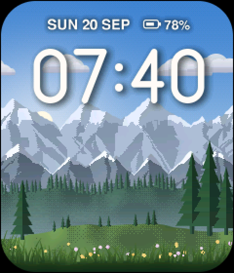
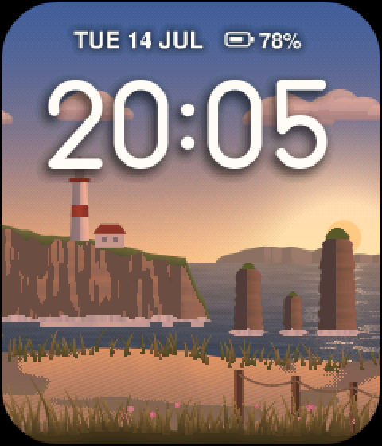
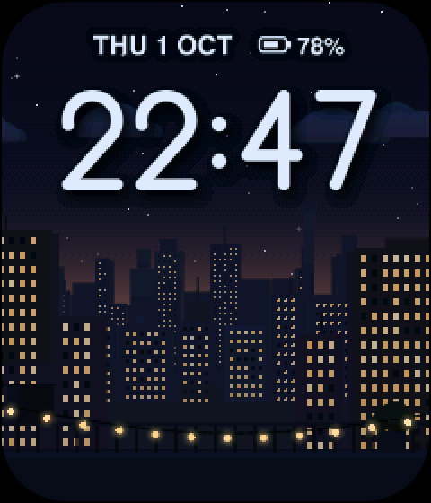
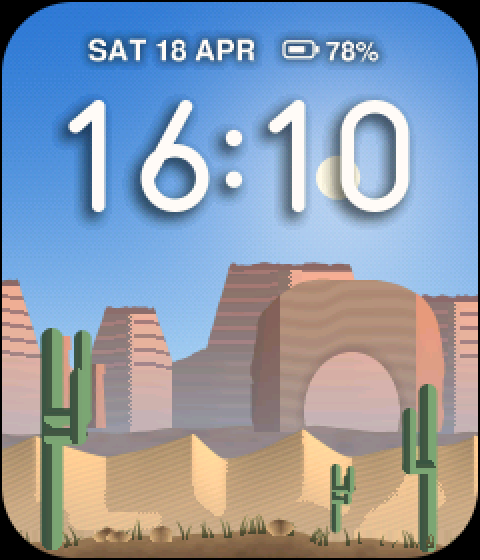
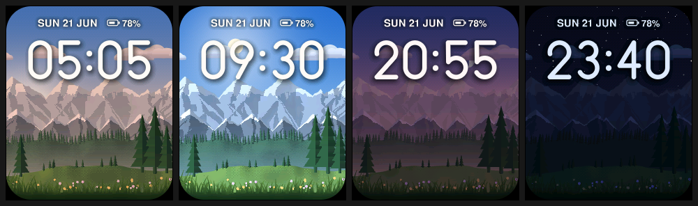

# Tilt Parallax

A watch face for the EWatch where the screen becomes a window into a 3D
landscape. The scene is drawn as stacked layers (sky, distant ranges, hills,
foreground) and each layer slides by its depth as you tilt your wrist, so the
flat panel reads as depth. The sky, sun, moon, stars and lighting follow the
real time of day and season. The time floats in the scene with a soft
shadow and always stays crisp.

Addon id `tilt-parallax`, type `watchface`. It's a complete EWatch firmware:
EWatch BaseOS (@ `dbe73c2`) with this face as the default `Screen::Watch`.
The launcher, Settings, sleep and the stock face are all still there.


| | |
|---|---|
|  |  |
|  |  |

`docs/tilt.gif` shows the parallax in motion and `docs/scene-change.gif` the
scene change. All images are rendered on a computer by the same engine code
the watch runs (see "Previews" below), with the panel's rounded corners
masked in.

## Using it

| On the face | Does |
|---|---|
| Tilt your wrist | The layers slide by depth. Hold any angle for a few seconds and it becomes the new centre. |
| Tap | Next scene: the landscape drops away layer by layer and the next one rises in. |
| Long-press, or swipe down | Parallax settings |
| Swipe up or swipe left | App launcher (as on the stock face) |
| Button / swipe right | Nothing on the face (they're "back" elsewhere) |

**Settings → Parallax** (also the long-press above). Tap a row to change it:

| Row | Options |
|---|---|
| Scene | Alpine, Coast, City, Desert |
| Depth | Off, Subtle, Normal (default), Strong |
| Clock | 24-hour (default), 12-hour |
| Ambient | On (default): clouds drift and stars twinkle. Off: still unless you tilt. |
| Face | Parallax (default) or Classic, the stock BaseOS face with its Font styles |

The status line at the top shows the date and battery level.

### The scenes

- **Alpine**: hazy far peaks with snow, a darker middle range, a forested ridge
  with valley mist, a meadow with tall pines, grass and wildflowers at the glass.
  Morning light catches the east faces and evening light the west faces.
- **Coast**: islands on the horizon, a headland with a lighthouse and keeper's
  cottage, sea stacks in the surf, marram-grass dunes, beach grass and a rope
  fence. The sea mirrors the sky and its glitter path follows the sun or moon.
  After dusk the lantern and the cottage windows glow.
- **City**: a hazy skyline with a needle tower, a middle skyline whose windows
  light up one by one after dusk (and fewer after midnight), framing towers,
  and a rooftop with a railing and string lights that glow at night.
- **Desert**: stratified mesas, a sandstone arch, sharp-crested dunes and
  saguaros. It has no clouds and the densest starfield of the four.



## How it works

### Tilt: from gravity to a smooth offset (`engine/tp_tilt.*`)

The MMA8451 has no gyro, so tilt comes from gravity alone.

1. **Every sample.** `taskIO` calls `tiltHookPush()` right after each
   `readAccel()` (about 45 Hz with jitter) and stamps it with `millis()`. The
   samples go through a lock-free single-producer/single-consumer ring
   (`engine/tp_ring.h`), and the face drains it every frame. Nothing polls
   `model` for accel data.
2. **Gravity low-pass** (τ = 50 ms, using the true per-sample dt). Samples
   whose magnitude is far from 1 g (the arm is accelerating) get less weight,
   so a shake barely moves the scene.
3. **Neutral pose.** A neutral gravity direction follows the current one with
   τ = 2.5 s. Whatever angle you naturally hold the watch at reads as centred,
   and the face reacts to changes in angle. For the first second after the
   face appears it adapts faster (τ = 0.25 s), so waking mid-gesture doesn't
   leave the scene off-centre.
4. **Pitch and roll.** The rotation that takes the neutral direction to the
   current one gives how far your eye has moved across the screen (roll → x,
   pitch → y, in radians). This is the same small-angle pitch/roll, but taken
   from the vector rotation so it doesn't hit atan2 singularities when the
   watch is held near vertical. Full scale is about 22°, and larger tilts
   saturate smoothly.
5. **Dead-zone with backlash** (0.012 of full scale, about a third of a
   pixel). The target only moves once the input has pushed past the dead-zone,
   then it follows at that distance. Sensor noise can't make the scene
   shimmer, but real motion still gets through.
6. **Critically damped spring** (ω = 11 rad/s, about 0.6 s to settle) eases
   the displayed offset toward the target. It's integrated exactly, so it's
   stable for any frame time and never overshoots a step or a ramp.
7. **Integer offsets with hysteresis.** Each layer's pixel offset is
   `depth × 18 px × strength × tilt`. It only changes when the exact value is
   more than 0.62 px away from the shown one, so a layer never flickers
   between two pixels.

The model is a window. Layers move in proportion to their depth behind the
glass: the sky moves most, the far ranges a bit less, the foreground grass
barely at all. The clock floats at depth 0.42. Its drop shadow sits slightly
deeper (0.56), so the shadow slides against the digits as you tilt and the
time appears to hover.

### Rendering (`engine/tp_layer.*`, `tp_compose.*`, `tp_engine.*`)

- **Layers, not redraws.** Each scene draws its art once, procedurally, into
  PSRAM layers that are wider than the screen by their maximum travel
  (overscan). Rows above a terrain layer's ridge are transparent, and its
  last row repeats downward, so no vertical overscan is needed.
- **Span lists.** After drawing, every layer row is run-length encoded into
  spans: SOLID (one colour, no memory reads), LUT (indexed copy) and BLEND
  (anti-aliased edge pixels). Transparent pixels cost nothing. Rows that are
  opaque across the whole layer are flagged, and the compositor starts each
  screen row at the nearest such layer, so everything hidden behind the
  ground is skipped.
- **Palettes, not pixels, change with the time.** Terrain layers store 8-bit
  indices: a material (rock facing left or right, snow, foliage, windows,
  lamps, water) and a 63-step level. The time of day changes only the
  per-layer lookup tables (256 entries per row band). Those tables handle
  sun or moon lighting by facing, haze that pales distant layers, valley mist
  toward a layer's bottom (via row bands), and windows and lamps that light
  up at night. Re-lighting a scene takes milliseconds and never re-renders art.
- **Sky.** RGB565 with ordered dithering: a gradient, sun glow and twilight
  band, stars (dimmed toward the horizon), the moon with its real phase and
  terminator, and the sea for Coast. It's re-rendered every 5 minutes.
- **Type.** The time uses an original geometric monoline digit set drawn from
  signed distance fields, anti-aliased at any size. The date line supersamples
  the project's FreeSansBold 24 pt glyphs down to about 11 px. Both draw into
  alpha sprites, with blurred copies as shadows.
- **Frames.** A frame is `composeRows()` over the rows that changed, in
  32-row strips in internal SRAM, each pushed straight to the panel with
  `draw16bitRGBBitmap`. When nothing moves, nothing is drawn.

  This departs from "compose into `frameCanvas()` and flush". The frame canvas
  lives in PSRAM: composing into it costs a write-allocate cache fill plus a
  write-back, and flushing reads it back, about 400 KB of PSRAM traffic per
  full frame on top of the ~18-22 ms SPI push. Composing in a 15 KB internal
  strip removes that and keeps full-frame motion comfortably above 30 fps. If
  the strip can't be allocated, the face falls back to composing into
  `frameCanvas()` and pushing the dirty rows. Building with
  `-DTP_COMPOSE_TO_CANVAS=1` forces that path, so the two can be compared on
  the watch with `bench`.
- **Dirty rows.** The renderer tracks which screen rows each offset change,
  clock tick, twinkle or cloud step touches. Only those rows are recomposed
  and sent.

Every fast path is checked pixel for pixel against a naive reference
compositor in the unit tests.

### Time of day (`engine/tp_sky.*`)

The sun's altitude comes from the standard solar-elevation formula using the
RTC's local date and time, at an assumed latitude of 48°N with solar noon at
12:30 local. Days are longer in June than in December, and dawn and dusk move
with the seasons. Sky colours, ambient light, sun colour and haze are keyed to
the sun's altitude, so dawn, golden hour, sunset, civil and nautical twilight
and night all arrive at the right moments. Dawn leans rose and dusk leans
amber. The moon's phase comes from the synodic month (it's checked against
known 2026 full, new and first-quarter moons). It rises about 50 minutes later
each day, its brightness follows its phase, and it lights the night scene.
Without a valid RTC the face shows "--:--" over a midsummer noon.

### Boot and wake

Waking from deep sleep is a full reboot, so two things make the face appear
fast and finished:

- **Prewarm.** The art is pure computation into PSRAM. `setup()` calls
  `parallaxBootPrewarm()` right after it knows it's staying awake (after the
  touch-wake check), which starts a core-0 task that draws the saved scene.
  Meanwhile `setup()` spends most of its next ~0.8 s in hardware `delay()`s
  (touch reset and drain, panel init), so the scene is normally ready before
  the display is. Scene changes reuse the same task while the face keeps
  animating on core 1.
- **Backlight gate.** Instead of stock's fixed `delay(80)`, `setup()` waits
  (at most 900 ms) for the face to put its first complete frame on the
  panel, then turns the backlight on. You never see a half-drawn face. If a
  scene is ever slow, the sky and clock appear first and the landscape rises
  in when ready.

### Settings and storage

Everything lives in the addon's own NVS namespace, `tilt-parallax`, under the
keys `ver`, `scene`, `depth`, `h12`, `ambient`, `classic` and `raise`. The
BaseOS `ewatch` namespace is untouched. Changes are written when you leave the
face or the settings page, or just before sleep or power-off. They're never
written mid-animation, because a flash write briefly stalls both cores.

## Power

The face keeps stock BaseOS sleep behaviour: deep sleep after the idle
timeout (default 5 s), then power-off after 30 s asleep. Tilting doesn't
count as activity.

| State | What runs | Extra current vs stock face (estimate) |
|---|---|---|
| Still | The filter runs every ~50 ms on 2-3 samples. No frames. | < 1 mA |
| Ambient on | A few rows redrawn ~2-8×/s (cloud step, twinkling stars) | ~1-2 mA |
| Wrist moving | Core 1 composes and pushes frames flat out (~35-45 fps) | ~25-35 mA |
| Waking | Scene drawn on core 0 during setup's hardware delays | ~30 mA for ~0.1-0.4 s |

**Battery estimate.** These are assumptions, not measurements. A glance is
about 6 s on screen, with the wrist moving for about 2.5 s of it, at roughly
50 mA for the stock face. That makes the extra cost about 0.03 mAh per
glance. At 150 glances a day that's about 4-5 mAh/day, roughly a third more
than the stock face's ~12 mAh/day of screen-on time, or about 2% of a 250 mAh
cell. Set Depth to "Off" and Ambient to "Off" to get back to stock behaviour
(the face then only redraws when the minute changes, plus a sky update every
5 minutes).

## Performance

The figures below are estimates from host benchmarks and the SPI driver's
structure. Measure them on the watch with the serial `bench` command and the
perf log.

- **Full frame while moving:** ~18-22 ms SPI push (32-pixel polled
  transactions at 60 MHz) plus ~4-7 ms compose (PSRAM-bandwidth bound).
  That's about 35-40 fps. Partial frames are proportionally faster.
- **Typical motion.** `preview bench` feeds the real tilt filter a wrist
  rocking ±10° roll and ±6° pitch at about 0.5 Hz. In that run, 70-80% of
  frames need sending, averaging 210-240 of 280 rows, and about half are
  full-screen. That's roughly 16 ms SPI plus ~5 ms compose per frame, around
  45 fps on average and 35+ at worst.
- **Scene generation on core 0:** Alpine is the heaviest. On the host it
  builds in ~4 ms, and the others take ~1-2 ms. On the ESP32-S3 expect
  roughly 100-250 ms for Alpine and less for the others, hidden behind
  boot or the drop-away animation.
- **Every 5 minutes:** re-render the sky and re-light (~10-50 ms, the Coast
  sea is the costliest). **Every minute:** re-render the clock sprite
  (~10-20 ms).
- **PSRAM:** ~300 KB for the renderer, plus 250-380 KB per scene. Two
  scenes coexist briefly during a scene change. Peak is around 1.1 MB of the
  2 MB, including the launcher's frame canvas.
- **Internal RAM:** 15 KB strip, plus the render task stack raised from 6 to
  10 KB. Firmware RAM is 16.6%, flash 34.2%.

## Limitations

- **Unverified on hardware.** Everything above was compiled, unit-tested and
  rendered on a computer, but has never run on a watch (none was connected).
  Timing figures are estimates. See the checklist below.
- **Tilt axis signs** follow BaseOS's IMU diagnostics, which treat the screen
  frame as (−x, y, z) of the chip. If the scene moves the "wrong" way (it
  still looks 3D, but like a diorama poking out of the glass rather than a
  window), flip it with the serial `axis x` / `axis y` commands and set
  `invertX` / `invertY` in `engine/tp_tilt.h`.
- **Gravity only.** Turning the watch about the vertical axis (yaw) can't be
  seen without a gyro or magnetometer, and walking with the arm swinging
  makes the scene sway a little (shake rejection softens it).
- **Sky geometry is approximate.** It assumes 48°N, solar noon at 12:30 and
  northern-hemisphere seasons. There's no location setting. The moon's
  declination is simplified. The sun or moon often passes behind the big
  digits; the digits' shadow keeps the time readable.
- **Small text** is a downsampled bitmap font (FreeSansBold): clean at ~11 px,
  but not hinted.
- **Battery %** is whatever BaseOS reads from the ADC divider. It's shown with
  hysteresis (2 points, or any change after a minute) so it doesn't flicker.
- The **settings page** uses BaseOS's built-in bitmap font like the other
  settings pages. It wasn't rendered on the host.

## Experimental: raise-to-wake (off by default)

Build with `-DTP_RAISE_TO_WAKE=1` to add a Settings → Parallax → **Raise**
row. When it's on, deep sleep puts the MMA8451 into 50 Hz low-power mode with
its high-pass TRANSIENT engine routed to **INT2 (GPIO4)**, and adds GPIO4 to
the ext1 wake mask. The threshold is ~0.5 g on X/Y with a 60 ms debounce and
a 0.25 Hz high-pass. This replaces the stock INT1 jolt-wake while it's on.
Boot restores the stock 800 Hz setup.

It's off because it can't be tuned without a wrist. False wakes (walking,
typing) cost a full boot each, and with the stock 30 s sleep→off timer it
only works shortly after a sleep, unless you set Settings → Sleep → off to
"never". Bonus: in that mode the accelerometer draws a few µA asleep instead
of the ~165 µA stock leaves it at.

## Build, test, package

From the repository root:

```sh
~/.platformio/penv/bin/pio run -d addons/Tilt_Parallax              # firmware (env:ewatch, default)
~/.platformio/penv/bin/pio test -d addons/Tilt_Parallax -e native   # 26 host unit tests
python3 tools/package_addon.py addons/Tilt_Parallax                 # build + dist/
addons/Tilt_Parallax/tools/render_previews.sh                       # regenerate docs/ images
```

The unit tests cover the following:

- **Tilt filter:** resting poses read centred, a change then recentres, axis
  directions, saturation, a spring with no overshoot on a step, a ramp or
  jittery frames, exact integration for any dt, the dead-zone holding still
  under noise but passing real motion, shake rejection, wake mid-motion, and
  the ring buffer.
- **Compositor:** pixel-identical to the reference over 60 random layer stacks
  × 12 frames, plus span encoding and blending.
- **Scenes:** every scene builds within its memory budget, is deterministic,
  has full overscan and clamp-safe bottoms, and never shows an undefined
  material at any hour or tilt extreme.
- **Renderer and sky:** dirty-row tracking and twinkle. Moon phase on known
  dates, longer days in June than December, morning light from the east, no
  palette jumps minute to minute, and a clock colour that's always bright.

### Previews

`tools/render_previews.sh` compiles `src/apps/parallax/engine/*.cpp` with
`clang++` together with `tools/preview/preview.cpp` (a small PNG writer and
driver), then renders `docs/`. The tool can also render any moment yourself:

```sh
tools/render_previews.sh build
.pio/preview/preview frame out.png --scene 2 --time 21:30 --date 2026-12-24 --tilt 0.5,0
.pio/preview/preview sheet out.png --scene 1 --times 06:00,12:00,20:00 --scale 1
.pio/preview/preview bench --scene 0     # build time, memory, compose cost, motion sim
```

## Serial console (optional)

At 115200 baud, newline-terminated. Commands run on the face, so they apply
while it's showing. Nothing here is needed for normal use.

| Command | Effect |
|---|---|
| `help` | List commands |
| `scene <n\|next>` | Change scene (animated) |
| `depth <0-3>` | Off / Subtle / Normal / Strong |
| `time <HH:MM\|off>` | Preview any time of day (doesn't touch the RTC) |
| `ambient on\|off`, `h12 on\|off` | Same as the settings rows |
| `perf on\|off` | fps / compose / push log every 2 s while moving (on by default) |
| `bench` | 90 full frames of synthetic motion; prints fps and per-stage ms |
| `tilt` | Filter state: raw, target, neutral pose, dropped samples |
| `axis x\|y` | Flip a tilt axis for this session |
| `info` | Scene, build time, memory, free heap and PSRAM |

The boot log also prints `tp: scene N (...) built in X ms` and `First frame
shown after X ms`.

## Hardware test checklist (Kyle and Ewan)

1. **Wake to a finished face.** Sleep, then wake by button and by touch. The
   landscape and time should appear at once, with no black or half-drawn
   frame. In the serial log, `built in` should be under ~400 ms and
   `First frame shown`, not `TIMEOUT`.
2. **Tilt direction.** Hold the watch as for a glance, then roll the right
   edge down and back. The sky and far mountains should slide the most, the
   grass hardly at all, and it should feel like looking through a window. If
   it feels inverted, try `axis x` / `axis y` and report which.
3. **Smoothness.** Sweep the wrist slowly and quickly while watching the
   `tp: .. fps` log, which should be ≥ 30. Run `bench` and note fps,
   compose ms and push ms.
4. **Stillness.** Lay the watch flat. The scene must not shimmer, and the perf
   log should stop (no frames), apart from cloud and star steps if Ambient
   is on.
5. **Recentring.** Hold an unusual angle for 3-4 s. The scene should drift
   back to centred without a jump.
6. **Gestures.** Tap changes scene (drop away, rise in). Long-press and
   swipe-down open Parallax settings. Swipe up and swipe left open the
   launcher. The button and swipe-right do nothing on the face. Each row in
   settings cycles. Face → Classic shows the stock face, and back again.
7. **Time of day.** `time 05:30`, `time 12:00`, `time 20:45`, `time 23:30`
   on each scene. Check dawn and dusk colours, the moon and stars, twinkling,
   the lighthouse and cottage glow, city windows and string lights.
8. **Persistence.** Change scene and settings, sleep and wake, then power off
   and on. Choices should be kept. The stock theme, WiFi and haptics settings
   should be unaffected.
9. **Battery line.** The % should match Sensor Test and not flicker.
10. **Memory.** Open the launcher, return, change scenes a few times, then
    run `info`. Free PSRAM should stay above ~500 KB with no build failures.
11. **Sleep.** The watch still sleeps after the idle timeout while you tilt
    (tilting isn't activity). The 3 s button hold still powers off.
12. **(Only `TP_RAISE_TO_WAKE=1` builds.)** Raise wakes the watch. Count
    false wakes during a walk.

## What changed in BaseOS

The addon's own code is in `src/apps/parallax/` (with the pure-C++ engine in
`engine/`). The BaseOS edits are small and each one is marked with a comment
in the code:

- `src/main.cpp`: start the prewarm after the touch-wake check, gate the
  backlight on the first frame (max 900 ms), and poll the serial console in
  `loop()`.
- `src/core/controller.cpp`: the `tiltHookPush()` call in `taskIO`, frame
  pacing in `taskRender` via `View::desiredFrameMs()`, a 10 KB render stack,
  saving settings before sleep and power-off, and optional raise-to-wake. It
  also fixes a stock bug: the timer alarm buzz passed 400 to a `uint8_t`,
  so the buzz came out weaker (144).
- `src/core/view.h`: `desiredFrameMs()` and `uiMarkFirstFrame()` /
  `uiFirstFrameShown()`.
- `src/core/model.h`: `Screen::ParallaxSettings`.
- `src/apps/system/view.cpp`: `Screen::Watch` is the parallax face unless
  Face = Classic, the Settings carousel gets a "Parallax" entry, and the stock
  face marks its first frame.
- `platformio.ini`: include paths, `TP_PERF_LOG`, the `native` test env and
  `default_envs`. Upstream's `disptest` env is removed because its source file
  isn't in the BaseOS slate, so it could never build.

## Licence and credits

MIT, same as upstream EWatch (see `LICENSE`). The art, digits, scenes and
code are original, and all of it is procedural, with no image assets. The
small text uses the FreeSansBold font that already ships with BaseOS.
